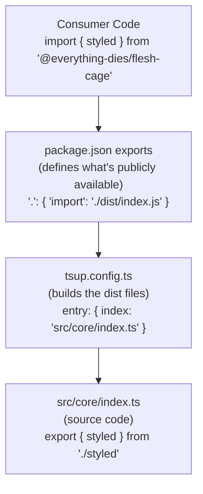
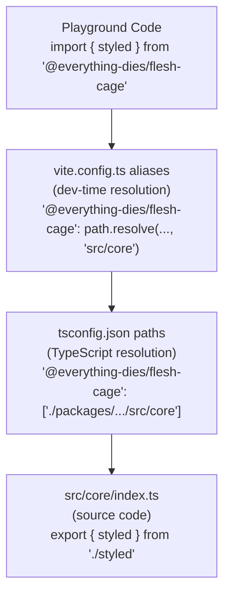

# Package Exports Configuration Guide

This guide documents all configuration points that need updating when adding, removing, or changing package exports in `@everything-dies/flesh-cage`.

## Overview: The Export Chain

When a consumer imports from your package, the resolution goes through multiple configuration layers:



For **local development** (monorepo), there are additional layers:



---

## Configuration Files to Update

### 1. **`packages/flesh-cage/tsup.config.ts`** - Build Configuration

**What it does:** Defines which source files to build and how

**When to update:** Adding/removing/renaming entry points

**Example - Single Entry (Current):**
```typescript
export default defineConfig({
  entry: {
    index: 'src/core/index.ts', // Main export = Core
  },
  format: ['esm', 'cjs'],
  dts: true,
  sourcemap: true,
  clean: true,
  treeshake: true,
  splitting: false,
  target: 'es2020',
  external: ['react', 'react-dom'],
})
```

**Example - Multiple Entries (Future):**
```typescript
export default defineConfig({
  entry: {
    index: 'src/core/index.ts',      // Main export
    macros: 'src/macros/index.ts',   // React macros
    vite: 'src/vite/index.ts',       // Vite plugin
  },
  format: ['esm', 'cjs'],
  // ... rest of config
  external: ['react', 'react-dom', 'vite'], // Add dependencies to externals
})
```

**Output:** Builds to `dist/[entry-name].js`, `dist/[entry-name].cjs`, `dist/[entry-name].d.ts`

---

### 2. **`packages/flesh-cage/package.json`** - Package Exports

**What it does:** Defines the public API - what consumers can import

**When to update:** Adding/removing/renaming export paths

**Example - Single Entry (Current):**
```json
{
  "main": "./dist/index.js",
  "module": "./dist/index.js",
  "types": "./dist/index.d.ts",
  "exports": {
    ".": {
      "import": {
        "types": "./dist/index.d.ts",
        "default": "./dist/index.js"
      },
      "require": {
        "types": "./dist/index.d.cts",
        "default": "./dist/index.cjs"
      }
    },
    "./package.json": "./package.json"
  }
}
```

**Example - Multiple Subpath Exports (Future):**
```json
{
  "main": "./dist/index.js",
  "module": "./dist/index.js",
  "types": "./dist/index.d.ts",
  "exports": {
    ".": {
      "import": {
        "types": "./dist/index.d.ts",
        "default": "./dist/index.js"
      },
      "require": {
        "types": "./dist/index.d.cts",
        "default": "./dist/index.cjs"
      }
    },
    "./macros": {
      "import": {
        "types": "./dist/macros.d.ts",
        "default": "./dist/macros.js"
      },
      "require": {
        "types": "./dist/macros.d.cts",
        "default": "./dist/macros.cjs"
      }
    },
    "./vite": {
      "import": {
        "types": "./dist/vite.d.ts",
        "default": "./dist/vite.js"
      },
      "require": {
        "types": "./dist/vite.d.cts",
        "default": "./dist/vite.cjs"
      }
    },
    "./package.json": "./package.json"
  }
}
```

**Consumer imports:**
```typescript
// Main entry
import { styled, Provider } from '@everything-dies/flesh-cage'

// Subpath exports
import { createShadowComponent } from '@everything-dies/flesh-cage/macros'
import fleshCagePlugin from '@everything-dies/flesh-cage/vite'
```

---

### 3. **`tsconfig.json`** - Root TypeScript Path Mapping

**What it does:** Tells TypeScript how to resolve imports in the monorepo

**When to update:** Adding/removing/renaming entry points

**Location:** `/tsconfig.json` (root of monorepo)

**Example - Single Entry (Current):**
```json
{
  "compilerOptions": {
    "baseUrl": ".",
    "paths": {
      "@everything-dies/flesh-cage": ["./packages/flesh-cage/src/core"]
    }
  }
}
```

**Example - Multiple Entries (Future):**
```json
{
  "compilerOptions": {
    "baseUrl": ".",
    "paths": {
      "@everything-dies/flesh-cage": ["./packages/flesh-cage/src/core"],
      "@everything-dies/flesh-cage/macros": ["./packages/flesh-cage/src/macros"],
      "@everything-dies/flesh-cage/vite": ["./packages/flesh-cage/src/vite"]
    }
  }
}
```

**Why needed:** Without this, TypeScript won't be able to resolve imports during development (before build)

---

### 4. **`examples/playground/tsconfig.json`** - Playground TypeScript

**What it does:** Tells TypeScript how to resolve imports specifically in the playground

**When to update:** Adding/removing/renaming entry points

**Location:** `/examples/playground/tsconfig.json`

**Example - Single Entry (Current):**
```json
{
  "extends": "../../tsconfig.json",
  "compilerOptions": {
    "baseUrl": ".",
    "paths": {
      "@everything-dies/flesh-cage": ["../../packages/flesh-cage/src/core"]
    }
  }
}
```

**Example - Multiple Entries (Future):**
```json
{
  "extends": "../../tsconfig.json",
  "compilerOptions": {
    "baseUrl": ".",
    "paths": {
      "@everything-dies/flesh-cage": ["../../packages/flesh-cage/src/core"],
      "@everything-dies/flesh-cage/macros": ["../../packages/flesh-cage/src/macros"],
      "@everything-dies/flesh-cage/vite": ["../../packages/flesh-cage/src/vite"]
    }
  }
}
```

**Note:** Must match the root tsconfig.json paths

---

### 5. **`examples/playground/vite.config.ts`** - Vite Dev Server

**What it does:** Tells Vite how to resolve imports during development

**When to update:** Adding/removing/renaming entry points

**Location:** `/examples/playground/vite.config.ts`

**Example - Single Entry (Current):**
```typescript
import path from 'path'

export default defineConfig({
  resolve: {
    alias: {
      '@everything-dies/flesh-cage': path.resolve(
        __dirname,
        '../../packages/flesh-cage/src/core'
      ),
    },
  },
})
```

**Example - Multiple Entries (Future):**
```typescript
import path from 'path'

export default defineConfig({
  resolve: {
    alias: {
      '@everything-dies/flesh-cage': path.resolve(
        __dirname,
        '../../packages/flesh-cage/src/core'
      ),
      '@everything-dies/flesh-cage/macros': path.resolve(
        __dirname,
        '../../packages/flesh-cage/src/macros'
      ),
      '@everything-dies/flesh-cage/vite': path.resolve(
        __dirname,
        '../../packages/flesh-cage/src/vite'
      ),
    },
  },
})
```

**Why needed:** Without this, Vite will try to resolve to `node_modules` or built files, losing HMR support

---

## Checklist: Adding a New Export

Let's say you want to add a `macros` subpath export:

### Step 1: Create the source entry point
```bash
# Create the new entry file
touch packages/flesh-cage/src/macros/index.ts
```

```typescript
// packages/flesh-cage/src/macros/index.ts
export { createShadowComponent } from './create-shadow-component'
export { withShadowStyles } from './with-shadow-styles'
export type { CreateShadowComponentConfig } from './types'
```

### Step 2: Update build configuration
```typescript
// packages/flesh-cage/tsup.config.ts
export default defineConfig({
  entry: {
    index: 'src/core/index.ts',
    macros: 'src/macros/index.ts', // ← ADD THIS
  },
  // ... rest
})
```

### Step 3: Add package.json export
```json
// packages/flesh-cage/package.json
{
  "exports": {
    ".": { /* ... */ },
    "./macros": {  // ← ADD THIS BLOCK
      "import": {
        "types": "./dist/macros.d.ts",
        "default": "./dist/macros.js"
      },
      "require": {
        "types": "./dist/macros.d.cts",
        "default": "./dist/macros.cjs"
      }
    }
  }
}
```

### Step 4: Add TypeScript path mapping (root)
```json
// tsconfig.json
{
  "paths": {
    "@everything-dies/flesh-cage": ["./packages/flesh-cage/src/core"],
    "@everything-dies/flesh-cage/macros": ["./packages/flesh-cage/src/macros"] // ← ADD THIS
  }
}
```

### Step 5: Add TypeScript path mapping (playground)
```json
// examples/playground/tsconfig.json
{
  "paths": {
    "@everything-dies/flesh-cage": ["../../packages/flesh-cage/src/core"],
    "@everything-dies/flesh-cage/macros": ["../../packages/flesh-cage/src/macros"] // ← ADD THIS
  }
}
```

### Step 6: Add Vite alias (playground)
```typescript
// examples/playground/vite.config.ts
export default defineConfig({
  resolve: {
    alias: {
      '@everything-dies/flesh-cage': path.resolve(__dirname, '../../packages/flesh-cage/src/core'),
      '@everything-dies/flesh-cage/macros': path.resolve(__dirname, '../../packages/flesh-cage/src/macros'), // ← ADD THIS
    },
  },
})
```

### Step 7: Build and test
```bash
# Build the package
yarn build

# Clear caches
rm -rf examples/playground/node_modules/.vite

# Test in playground
yarn dev
```

### Step 8: Verify
```typescript
// examples/playground/src/App.tsx
import { createShadowComponent } from '@everything-dies/flesh-cage/macros' // ✅ Should work
```

---

## Checklist: Removing an Export

Let's say you want to remove the `macros` subpath export:

### Step 1: Remove from tsup config
```typescript
// packages/flesh-cage/tsup.config.ts
export default defineConfig({
  entry: {
    index: 'src/core/index.ts',
    // macros: 'src/macros/index.ts', // ← REMOVE THIS
  },
})
```

### Step 2: Remove from package.json exports
```json
// packages/flesh-cage/package.json
{
  "exports": {
    ".": { /* ... */ },
    // "./macros": { ... } // ← REMOVE THIS BLOCK
  }
}
```

### Step 3: Remove TypeScript path mapping (root)
```json
// tsconfig.json
{
  "paths": {
    "@everything-dies/flesh-cage": ["./packages/flesh-cage/src/core"],
    // "@everything-dies/flesh-cage/macros": [...] // ← REMOVE THIS
  }
}
```

### Step 4: Remove TypeScript path mapping (playground)
```json
// examples/playground/tsconfig.json
{
  "paths": {
    "@everything-dies/flesh-cage": ["../../packages/flesh-cage/src/core"],
    // "@everything-dies/flesh-cage/macros": [...] // ← REMOVE THIS
  }
}
```

### Step 5: Remove Vite alias (playground)
```typescript
// examples/playground/vite.config.ts
export default defineConfig({
  resolve: {
    alias: {
      '@everything-dies/flesh-cage': path.resolve(__dirname, '../../packages/flesh-cage/src/core'),
      // '@everything-dies/flesh-cage/macros': ... // ← REMOVE THIS
    },
  },
})
```

### Step 6: Update imports in playground
```typescript
// If you had:
import { createShadowComponent } from '@everything-dies/flesh-cage/macros'

// Change to:
import { createShadowComponent } from '@everything-dies/flesh-cage'
// (Only if you re-exported it from core)
```

### Step 7: Clean and rebuild
```bash
yarn clean
yarn build
```

---

## Checklist: Renaming an Export

Let's say you want to rename `macros` to `react`:

Follow the **"Adding"** checklist for the new name, then the **"Removing"** checklist for the old name.

**Or do it atomically:**

1. Update all 6 configuration files at once, changing `macros` → `react`
2. Rename the source directory: `mv src/macros src/react`
3. Update imports in playground
4. Clean and rebuild

---

## Common Pitfalls

### ❌ Forgetting to clear caches
**Problem:** Vite or TypeScript still resolves to old paths

**Solution:**
```bash
rm -rf examples/playground/node_modules/.vite
rm -rf packages/flesh-cage/dist
yarn build
```

### ❌ Mismatched paths between configs
**Problem:** TypeScript path points to `src/core` but Vite points to `src/macros`

**Solution:** Always keep all 3 path configs in sync:
- `tsconfig.json` (root)
- `examples/playground/tsconfig.json`
- `examples/playground/vite.config.ts`

### ❌ Forgetting external dependencies
**Problem:** Build fails or includes React/Vite in bundle

**Solution:** Add to `tsup.config.ts`:
```typescript
external: ['react', 'react-dom', 'vite'],
```

### ❌ Export path doesn't match build output
**Problem:** `package.json` exports `"./macros"` but tsup builds `macros-plugin.js`

**Solution:** Entry name in tsup must match export path:
```typescript
// tsup.config.ts
entry: {
  macros: 'src/macros/index.ts', // Builds to dist/macros.js
}

// package.json
"./macros": { "default": "./dist/macros.js" } // ✅ Matches
```

---

## Quick Reference Matrix

| Config File | Purpose | Update When | Path Format |
|------------|---------|-------------|-------------|
| `tsup.config.ts` | Build source → dist | Add/remove entry | `src/[name]/index.ts` |
| `package.json` | Define public API | Add/remove entry | `./dist/[name].js` |
| `tsconfig.json` (root) | TS resolution (dev) | Add/remove entry | `./packages/flesh-cage/src/[name]` |
| `playground/tsconfig.json` | TS resolution (playground) | Add/remove entry | `../../packages/flesh-cage/src/[name]` |
| `playground/vite.config.ts` | Vite resolution (dev) | Add/remove entry | `path.resolve(...)` |

---

## Testing Your Changes

### 1. TypeScript Resolution
```bash
# From root
yarn typecheck

# Should have no errors about missing modules
```

### 2. Build Output
```bash
yarn build

# Check dist/ contains expected files
ls packages/flesh-cage/dist/
# Should see: index.js, [entry].js, etc.
```

### 3. Runtime (Dev Server)
```bash
yarn dev

# Open browser, check console for import errors
```

### 4. Runtime (Built Package)
```bash
# In a test project
npm install /path/to/flesh-cage/packages/flesh-cage

# Try importing
import { something } from '@everything-dies/flesh-cage'
import { something } from '@everything-dies/flesh-cage/macros'
```

---

## File Locations Summary

All paths relative to monorepo root (`/Users/deusmorto/_dev/flesh-cage/`):

```
.
├── tsconfig.json                              # Root TS config
├── packages/flesh-cage/
│   ├── package.json                           # Package exports
│   ├── tsup.config.ts                         # Build config
│   └── src/
│       ├── core/index.ts                      # Entry point
│       ├── macros/index.ts                    # Entry point
│       └── vite/index.ts                      # Entry point
└── examples/playground/
    ├── tsconfig.json                          # Playground TS config
    └── vite.config.ts                         # Playground Vite config
```

---

## Summary

When adding/removing/changing exports, you must update **5 files**:

1. ✅ `packages/flesh-cage/tsup.config.ts` - Build configuration
2. ✅ `packages/flesh-cage/package.json` - Public API definition
3. ✅ `tsconfig.json` - Root TypeScript paths
4. ✅ `examples/playground/tsconfig.json` - Playground TypeScript paths
5. ✅ `examples/playground/vite.config.ts` - Playground Vite aliases

**Plus:** Clean caches and rebuild!

```bash
rm -rf examples/playground/node_modules/.vite
rm -rf packages/flesh-cage/dist
yarn build
yarn dev
```
