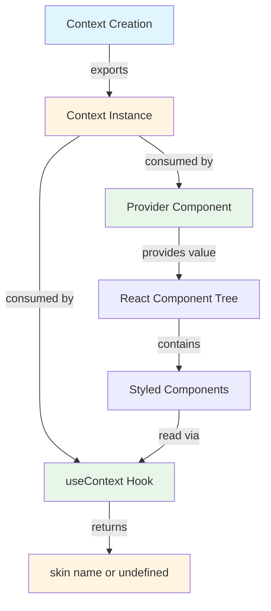
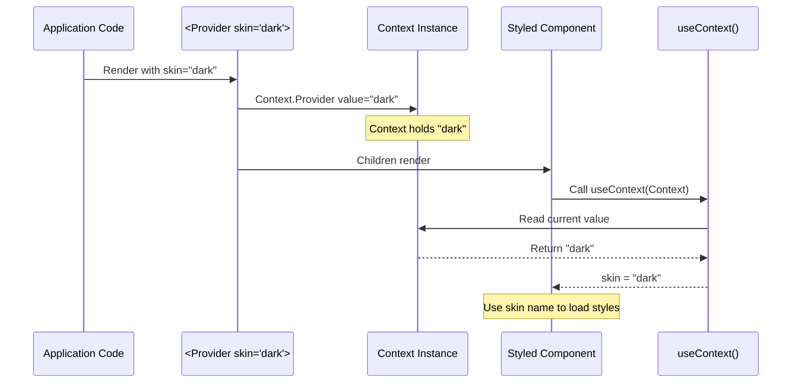
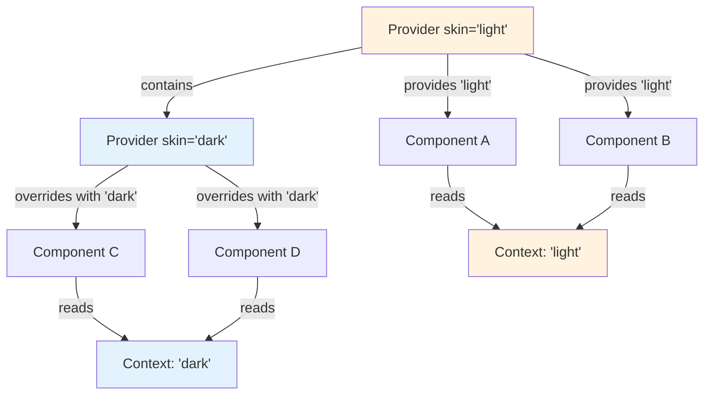

# Context - React Context for Skin Propagation

## Overview

The `context/` module exports a single React Context instance that serves as the backbone of the flesh-cage theming system. This Context enables skin names to propagate from Provider components down through the React component tree to individual styled components without prop drilling.

**Purpose:** Create a centralized communication channel for skin names to flow from theme providers to styled components, enabling dynamic theming with zero prop overhead.

**Lines of code:** 3 lines (1 import, 1 export, 1 blank line)

**Dependencies:** Only imports from `react` (no internal dependencies)

**Dependents:**

- `../use-context/` - Consumes this Context via `useContext` hook
- `../provider/` - Provides values through this Context's Provider component

## Philosophy & Design Decisions

### Why React Context?

React Context solves the "prop drilling" problem for cross-cutting concerns like theming. Without Context, every component in the tree would need to accept and forward a `skin` prop:

```tsx
// ❌ Without Context - prop drilling hell
<App skin="dark">
  <Layout skin="dark">
    <Sidebar skin="dark">
      <Menu skin="dark">
        <Button skin="dark">Click</Button>
      </Menu>
    </Sidebar>
  </Layout>
</App>

// ✅ With Context - clean component tree
<Provider skin="dark">
  <App>
    <Layout>
      <Sidebar>
        <Menu>
          <Button>Click</Button>
        </Menu>
      </Sidebar>
    </Layout>
  </App>
</Provider>
```

### Why `undefined` as the Default Value?

The Context is created with `undefined` as its default value:

```typescript
createContext<string | undefined>(undefined)
```

This design choice is **intentional and critical**:

1. **Signals missing Provider:** When a component renders outside a Provider, `undefined` clearly indicates "no theme context available"

2. **Type-safe absence:** TypeScript's `string | undefined` forces consumers to handle the undefined case, preventing runtime errors

3. **Opt-in theming:** Components work without a Provider (using component-level skin props), but gain automatic theming when wrapped in one

4. **Debugging aid:** Seeing `undefined` in DevTools immediately shows that a Provider is missing

**Alternative considered:** Using a default skin name like `'default'` was rejected because:

- It hides configuration errors (missing Provider looks like working code)
- It couples the Context to specific skin names
- It breaks the "explicit is better than implicit" principle

### Trade-offs

**Pros:**

- Zero runtime overhead (Context is a React primitive)
- No prop drilling across intermediate components
- Supports nested Providers with override behavior
- Type-safe with TypeScript's union types

**Cons:**

- Components can only access one skin at a time (no multi-theme composition)
- Context updates cause re-renders of all consumers (though React optimizes this)
- Requires understanding React Context API to debug
- `undefined` default means consumers must handle absence

### Alternatives Considered

1. **Redux/Zustand store:**
   - Rejected: Over-engineered for a single string value
   - Rejected: Adds external dependencies and bundle size

2. **CSS custom properties (CSS variables):**
   - Rejected: Requires runtime stylesheet injection
   - Rejected: Can't trigger async skin loading
   - Rejected: No TypeScript type safety

3. **Module-level singleton:**
   - Rejected: Breaks server-side rendering (shared state)
   - Rejected: Can't support multiple themes in same app
   - Rejected: No component tree isolation

4. **Prop drilling:**
   - Rejected: Verbose and error-prone
   - Rejected: Couples all components to theming concern
   - Rejected: Makes refactoring harder

## Architecture

### Context Flow Diagram



### Provider to Consumer Flow



### Nested Provider Behavior



## Code Walkthrough

### The Entire Module (All 3 Lines)

```typescript
import { createContext } from 'react'

export const Context = createContext<string | undefined>(undefined)
```

Despite being only 3 lines, each line carries significant meaning.

### Line 1: Import Statement

```typescript
import { createContext } from 'react'
```

**What it does:**

- Imports React's `createContext` factory function
- Uses named import (not default) following React conventions

**Why not import React?**

- We only need `createContext`, not the entire React namespace
- Tree-shaking works better with named imports
- Explicit imports make dependencies clearer

**Type implications:**

- `createContext` is a generic function: `createContext<T>(defaultValue: T)`
- Returns a `Context<T>` object with `.Provider` and `.Consumer` properties

### Line 3: Context Creation and Export

```typescript
export const Context = createContext<string | undefined>(undefined)
```

**Breaking it down:**

1. **`export const`**: Immediate export of a constant binding
   - Makes Context available to other modules
   - `const` ensures the Context identity never changes (critical for React reconciliation)

2. **`Context`**: The variable name
   - Capitalized following React component naming conventions
   - Short and memorable
   - Not `SkinContext` to avoid redundancy (`core/context` path already implies purpose)

3. **`createContext<string | undefined>`**: Generic type annotation
   - **`string`**: The Context will hold skin names like `'dark'`, `'light'`, etc.
   - **`| undefined`**: The Context can also be `undefined` when no Provider exists
   - Type parameter must match default value's type

4. **`(undefined)`**: The default value
   - Used when components access Context outside a Provider
   - `undefined` signals "no theme context available"
   - Must be type-compatible with generic parameter

**What this creates:**

A React Context object with the following shape:

```typescript
{
  Provider: React.ComponentType<{ value: string | undefined; children?: ReactNode }>
  Consumer: React.ComponentType<{ children: (value: string | undefined) => ReactNode }>
  displayName?: string
}
```

**Critical invariant:** The Context identity (the object reference) MUST remain stable across renders. This is why we use `const` and define it at module level, not inside a function.

### The Missing Lines (Intentionally Absent)

**No default skin name:**

```typescript
// ❌ NOT done (intentionally)
export const Context = createContext<string>('default')
```

This would hide missing Providers and create silent bugs.

**No displayName:**

```typescript
// ❌ NOT done (could be added for debugging)
Context.displayName = 'SkinContext'
```

While helpful in React DevTools, it's omitted to keep the module minimal. Could be added if debugging becomes difficult.

**No Consumer export:**

```typescript
// ❌ NOT done (intentionally)
export const Consumer = Context.Consumer
```

We use the `useContext` hook instead of render props pattern (hooks are cleaner).

## Usage Examples

### Basic Context Consumption

```typescript
import { useContext } from 'react'
import { Context } from '@everything-dies/flesh-cage/core/context'

function MyComponent() {
  const skin = useContext(Context)

  console.log(skin) // 'dark' | 'light' | undefined

  return <div>Current skin: {skin ?? 'none'}</div>
}
```

### Providing a Context Value

```typescript
import { Context } from '@everything-dies/flesh-cage/core/context'

function App() {
  return (
    <Context.Provider value="dark">
      <MyComponent />
    </Context.Provider>
  )
}

// MyComponent will receive "dark"
```

### Handling Undefined (No Provider)

```typescript
import { useContext } from 'react'
import { Context } from '@everything-dies/flesh-cage/core/context'

function ThemedButton() {
  const skin = useContext(Context)

  if (skin === undefined) {
    console.warn('ThemedButton rendered outside Provider')
    // Fallback behavior
    return <button>No theme</button>
  }

  // Use skin to load styles
  return <button data-skin={skin}>Themed</button>
}
```

### Nested Providers (Override Pattern)

```typescript
import { Context } from '@everything-dies/flesh-cage/core/context'

function App() {
  return (
    <Context.Provider value="light">
      <Header /> {/* Gets "light" */}

      <Context.Provider value="dark">
        <Sidebar /> {/* Gets "dark" (overridden) */}
      </Context.Provider>

      <Footer /> {/* Gets "light" */}
    </Context.Provider>
  )
}
```

### Dynamic Context Values

```typescript
import { useState } from 'react'
import { Context } from '@everything-dies/flesh-cage/core/context'

function ThemeController() {
  const [theme, setTheme] = useState<'light' | 'dark'>('light')

  return (
    <Context.Provider value={theme}>
      <button onClick={() => setTheme(theme === 'light' ? 'dark' : 'light')}>
        Toggle Theme
      </button>
      <App />
    </Context.Provider>
  )
}
```

## Related Modules

### Dependencies (Imports)

- **`react`**: For `createContext` function

### Dependents (Imported By)

- **[`../use-context/`](../use-context/README.md)**: Wraps this Context in a convenient hook
- **[`../provider/`](../provider/README.md)**: Uses `Context.Provider` to distribute skin names
- **[`../use-core/`](../use-core/README.md)**: Indirectly uses this via `useContext` hook

### Conceptual Relationships

- **[`../types/`](../types/README.md)**: Defines the `ProviderProps` interface that includes the skin string type
- **[`../styled/`](../styled/README.md)**: End consumer of Context values via styled components

## Testing Strategy

### What We Test

1. **Context creation:**
   - Context object is created successfully
   - Context has `Provider` and `Consumer` properties
   - Context identity is stable across imports

2. **Default value:**
   - Default value is `undefined`
   - Consumers receive `undefined` outside Provider
   - Type system enforces `string | undefined`

3. **Value propagation:**
   - Provider successfully passes values to consumers
   - Nested Providers override parent values
   - Multiple consumers receive same value

4. **Type safety:**
   - TypeScript accepts valid string values
   - TypeScript accepts `undefined`
   - TypeScript rejects other types (number, object, etc.)

### How We Test

Tests use React Testing Library to verify Context behavior:

```typescript
import { render } from '@testing-library/react'
import { useContext } from 'react'
import { Context } from '../index'

it('provides undefined by default', () => {
  let receivedValue: string | undefined = 'not-set'

  function Consumer() {
    receivedValue = useContext(Context)
    return null
  }

  render(<Consumer />)

  expect(receivedValue).toBe(undefined)
})
```

See [`__tests__/context.test.tsx`](./__tests__/context.test.tsx) for full test suite.

### Coverage Goals

- **Line coverage:** 100% (all 3 lines)
- **Branch coverage:** N/A (no branches)
- **Integration:** Covered by `provider/` and `use-context/` tests

## Common Pitfalls

### Pitfall 1: Creating Multiple Context Instances

```typescript
// ❌ Wrong - creates a NEW Context (not the shared one)
import { createContext } from 'react'
const MyContext = createContext<string | undefined>(undefined)

// ✅ Correct - import the shared Context
import { Context } from '@everything-dies/flesh-cage/core/context'
```

**Why it matters:** Each `createContext()` call creates a separate communication channel. Providers on one Context don't affect consumers on another.

### Pitfall 2: Assuming Default Value is Used Inside Provider

```typescript
// ❌ Wrong assumption
<Context.Provider value={undefined}>
  <MyComponent />
</Context.Provider>
// MyComponent receives undefined from Provider, not default

// The default is ONLY used when no Provider exists:
<MyComponent />
// MyComponent receives undefined from default value
```

**Why it matters:** The default value is a fallback, not a fallback for Provider values.

### Pitfall 3: Mutating Context Value

```typescript
// ❌ Wrong - Context values should be immutable
const skin = { name: 'dark' }
<Context.Provider value={skin.name}>
  <button onClick={() => { skin.name = 'light' }}>Switch</button>
</Context.Provider>

// ✅ Correct - use state and pass new values
const [skin, setSkin] = useState('dark')
<Context.Provider value={skin}>
  <button onClick={() => setSkin('light')}>Switch</button>
</Context.Provider>
```

**Why it matters:** Mutating the value object doesn't trigger re-renders. Context only updates on reference change.

### Pitfall 4: Using Context.Consumer Instead of useContext

```typescript
// ❌ Verbose - render props pattern
<Context.Consumer>
  {(skin) => <div>Skin: {skin}</div>}
</Context.Consumer>

// ✅ Cleaner - hooks pattern
function MyComponent() {
  const skin = useContext(Context)
  return <div>Skin: {skin}</div>
}
```

**Why it matters:** Hooks are more readable and composable. Consumer is legacy API.

## Future Enhancements

### Planned Improvements

1. **Display name for DevTools:**

   ```typescript
   Context.displayName = 'FleshCageSkinContext'
   ```

   Would improve debugging in React DevTools.

2. **Multiple context values:**

   ```typescript
   createContext<{ skin: string; mode: 'light' | 'dark' } | undefined>(
     undefined
   )
   ```

   Could support additional theming metadata.

3. **Context validation:**
   ```typescript
   // Development-mode validator
   if (process.env.NODE_ENV === 'development') {
     Context.Provider = wrapWithValidation(Context.Provider)
   }
   ```

### Potential Breaking Changes

- **v2.0:** May change type to `string` (non-nullable) and throw errors when undefined, requiring Provider for all usage
- **v2.0:** May expand to object type `{ skin: string; options?: ThemeOptions }`

## Maintainer Notes: If I Die Tomorrow

### Critical Invariants (DO NOT BREAK)

1. **Context identity MUST remain stable:**
   - NEVER recreate the Context on re-render or re-import
   - Always defined at module level with `const`
   - One Context instance per module import (singleton behavior)

2. **Default value MUST be `undefined`:**
   - DO NOT change to a default skin name
   - `undefined` is the contract for "no Provider available"
   - Changing this is a BREAKING CHANGE for all consumers

3. **Type MUST be `string | undefined`:**
   - DO NOT make it non-nullable (`string` only)
   - DO NOT widen to `any` or `unknown`
   - Type must match default value and Provider value type

4. **Export name MUST remain `Context`:**
   - Changing the export name breaks all imports
   - DO NOT rename to `SkinContext`, `ThemeContext`, etc.
   - Keep it short and obvious

### Fragile Areas

1. **React version compatibility:**
   - This code works with React 16.8+ (when Hooks were introduced)
   - If React changes `createContext` API, this breaks
   - Pin React version in package.json

2. **TypeScript strict mode:**
   - Code assumes `strictNullChecks` is enabled
   - Without it, `undefined` checking doesn't work properly
   - Ensure `tsconfig.json` has `"strict": true`

3. **Module resolution:**
   - Assumes ES modules (`import`/`export`)
   - CJS (`require`) should work but is untested
   - Build tools must preserve module structure

### Debugging Guide

#### Problem: "Context value is always undefined"

**Likely causes:**

1. Missing Provider wrapper
2. Provider is rendered after consumer
3. Wrong Context imported (duplicate instances)

**Fix:**

```typescript
// Verify Provider wraps consumers
<Context.Provider value="dark">
  <MyComponent /> {/* ✅ Inside Provider */}
</Context.Provider>
<OtherComponent /> {/* ❌ Outside Provider - gets undefined */}
```

#### Problem: "TypeScript error: Type 'string' is not assignable to 'string | undefined'"

**Likely cause:** Trying to use Context value without checking for undefined

**Fix:**

```typescript
const skin = useContext(Context)

// ❌ Wrong - skin might be undefined
const uppercased = skin.toUpperCase()

// ✅ Correct - handle undefined
const uppercased = skin?.toUpperCase() ?? 'DEFAULT'
```

#### Problem: "Changes to Context value don't trigger re-renders"

**Likely causes:**

1. Mutating the value instead of replacing it
2. Provider value is a constant reference

**Fix:**

```typescript
// ❌ Wrong - same reference
const theme = 'dark'
<Context.Provider value={theme}>

// ✅ Correct - use state
const [theme, setTheme] = useState('dark')
<Context.Provider value={theme}>
```

#### Problem: "React DevTools shows 'Context' with no name"

**Fix:** Add display name for debugging:

```typescript
if (process.env.NODE_ENV === 'development') {
  Context.displayName = 'FleshCageSkinContext'
}
```

### When to Modify This File

**SAFE changes:**

- Add display name for debugging
- Add JSDoc comments
- Add development-mode validation

**BREAKING changes (require major version bump):**

- Change default value (undefined → something else)
- Change type (string | undefined → something else)
- Rename export

**NEVER do:**

- Make Context non-const (breaks identity stability)
- Move Context creation inside a function (breaks singleton)
- Remove export (breaks all dependents)

### Performance Considerations

1. **Context updates trigger re-renders:**
   - All consumers re-render when Provider value changes
   - React optimizes this with bailout checks
   - Use `React.memo()` on consumers to prevent unnecessary renders

2. **Context object creation is cheap:**
   - `createContext()` is O(1) operation
   - Context object is ~100 bytes in memory
   - Zero runtime overhead beyond normal React reconciliation

3. **Optimization tips:**
   ```typescript
   // Memoize Provider value to prevent unnecessary updates
   const theme = useMemo(() => computeTheme(), [dependencies])
   <Context.Provider value={theme}>
   ```

### Emergency Contacts

- **React Context API docs:** https://react.dev/reference/react/createContext
- **TypeScript union types:** https://www.typescriptlang.org/docs/handbook/2/everyday-types.html#union-types
- **React Context patterns:** Check `provider/` and `use-context/` modules

### Related Patterns

This Context follows the **Publish-Subscribe pattern**:

- **Publisher:** Provider component sets the value
- **Subscribers:** Components using `useContext()` hook
- **Channel:** The Context object itself

This is similar to:

- Redux's `Provider` and `connect`
- MobX's `Provider` and `inject`
- Styled-components' `ThemeProvider` and `useTheme`

The key difference: flesh-cage Context only holds a string (skin name), not complex objects.
