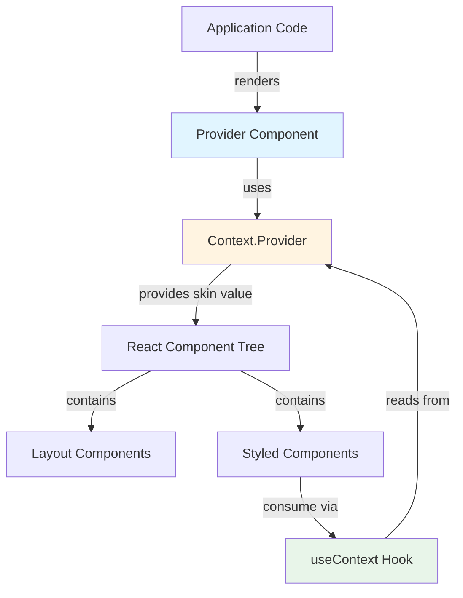
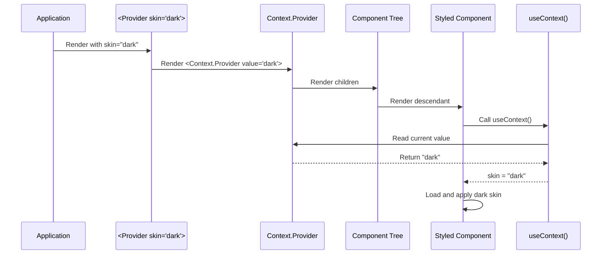
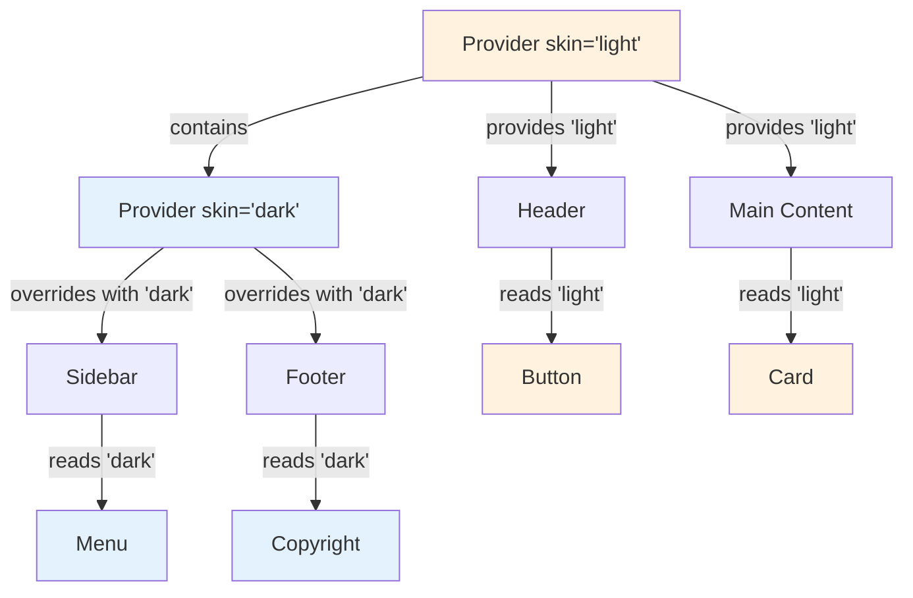
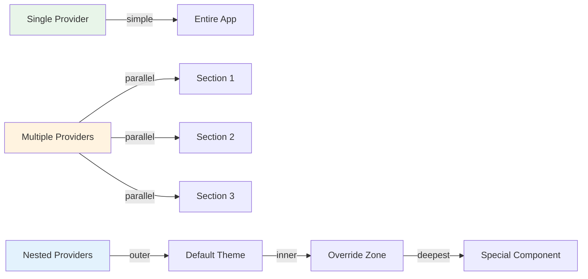

# Provider - Skin Theme Context Provider

## Overview

The `provider/` module exports a React component that wraps the flesh-cage Context Provider, enabling skin-based theming across component trees. It serves as the entry point for applying themes to applications, setting the active skin name that descendant styled components will consume.

**Purpose:** Provide a clean, type-safe API for distributing skin names through the React component tree, enabling dynamic theming without prop drilling or global state management.

**Lines of code:** 8 lines (2 type imports, 1 context import, 1 component definition with 4 lines of implementation)

**Dependencies:**

- `react` - For `FC` type
- `../types/` - For `ProviderProps` interface
- `../context/` - For the Context instance

**Dependents:**

- User applications - Primary entry point for theming
- Test suites - Used to wrap components for theme testing
- Storybook/demos - Used to demonstrate different themes

## Philosophy & Design Decisions

### Why a Provider Component?

The Provider pattern is a fundamental React pattern for distributing data through component trees without prop drilling. Our Provider component specifically:

1. **Encapsulates Context complexity:** Users don't need to know about `Context.Provider`—they just use `<Provider>`

2. **Enforces type safety:** The `ProviderProps` interface ensures only valid props are passed

3. **Provides semantic clarity:** `<Provider skin="dark">` is more readable than `<Context.Provider value="dark">`

4. **Enables future extensibility:** We can add validation, logging, or other logic without changing the API

**Without Provider component:**

```tsx
import { Context } from '@everything-dies/flesh-cage/core/context'

// ❌ Verbose, exposes implementation details
;<Context.Provider value="dark">
  <App />
</Context.Provider>
```

**With Provider component:**

```tsx
import { Provider } from '@everything-dies/flesh-cage/core'

// ✅ Clean, semantic API
;<Provider skin="dark">
  <App />
</Provider>
```

### Why Functional Component with FC Type?

```typescript
export const Provider: FC<ProviderProps> = ({ skin, children }) => { ... }
```

**Rationale:**

1. **Explicit children typing:** `FC<ProviderProps>` includes `children` automatically via React.PropsWithChildren

2. **JSX element return type:** `FC` ensures the return type is compatible with JSX

3. **React conventions:** Functional components are the modern standard (over class components)

4. **Performance:** No class instance overhead, just a function call

**Alternative considered:**

```typescript
// Rejected: Verbose, manual children typing
export function Provider(props: ProviderProps & { children: ReactNode }): JSX.Element {
  return <Context.Provider value={props.skin}>{props.children}</Context.Provider>
}
```

### Why No Validation or Default Values?

The Provider component is intentionally "dumb"—it doesn't validate the `skin` prop or provide defaults. Why?

1. **Single Responsibility:** Provider's job is to distribute values, not validate them

2. **Performance:** No validation overhead on every render

3. **Flexibility:** Allows dynamic, unknown skin names (useful for user-generated themes)

4. **Error location:** Validation at the component level (where skins are used) gives better error messages

**Rejected alternatives:**

```typescript
// ❌ Rejected: Validation in Provider
export const Provider: FC<ProviderProps> = ({ skin, children }) => {
  if (!skin) {
    throw new Error('Provider requires a skin prop')
  }
  return <Context.Provider value={skin}>{children}</Context.Provider>
}
// Reason: Too opinionistic, breaks use cases where skin comes from state

// ❌ Rejected: Default skin value
export const Provider: FC<ProviderProps> = ({ skin = 'default', children }) => {
  return <Context.Provider value={skin}>{children}</Context.Provider>
}
// Reason: Hides configuration errors, couples Provider to specific skin name
```

### Trade-offs

**Pros:**

- Clean, minimal API (just `skin` and `children`)
- Zero runtime overhead (thin wrapper)
- Type-safe via TypeScript
- Supports nesting for theme overrides
- Composable with other Context providers

**Cons:**

- No built-in validation (validation happens later in chain)
- Doesn't prevent invalid skin names
- Re-renders all consumers when skin changes (React behavior)
- Requires understanding of Provider/Consumer pattern

### Alternatives Considered

1. **Higher-Order Component (HOC):**

   ```typescript
   export const withSkin = (skin: string) => (Component) => (props) =>
     <Provider skin={skin}><Component {...props} /></Provider>
   ```

   - Rejected: Less flexible than Provider component
   - Rejected: HOCs are legacy pattern (hooks are modern)

2. **Global state (Redux/Zustand):**
   - Rejected: Over-engineered for single string value
   - Rejected: Adds dependencies and complexity
   - Rejected: Can't support isolated themes (multiple Providers in same app)

3. **CSS custom properties:**
   - Rejected: Can't trigger async skin loading
   - Rejected: No TypeScript support
   - Rejected: Limited browser support (older browsers)

4. **Render props:**

   ```typescript
   <Provider skin="dark" render={children} />
   ```

   - Rejected: Less ergonomic than children prop
   - Rejected: Harder to compose with other components

## Architecture

### Provider Component Tree



### Data Flow Sequence



### Nesting Behavior



### Provider Composition Patterns



## Code Walkthrough

### The Entire Module (All 8 Lines)

```typescript
import type { FC } from 'react'

import type { ProviderProps } from './types'
import { Context } from './context'

export const Provider: FC<ProviderProps> = ({ skin, children }) => {
  return <Context.Provider value={skin}>{children}</Context.Provider>
}
```

Despite being minimal, this component is the foundation of the theming system.

### Line 1: Type Imports

```typescript
import type { FC } from 'react'
```

**Why `type` import?**

- Erased at runtime (no bundle size impact)
- Signals to TypeScript this is type-only
- Prevents accidental usage of types as values

**Why `FC` type?**

- `FC` = `FunctionComponent` (shorthand)
- Provides correct return type (`ReactElement | null`)
- Includes `children` in props automatically (via `PropsWithChildren`)
- Standard pattern in React TypeScript codebases

### Line 3-4: Dependency Imports

```typescript
import type { ProviderProps } from './types'
import { Context } from './context'
```

**`ProviderProps` import:**

- Type-only import (no runtime code)
- Defines the shape: `{ skin: string, children: ReactNode }`
- Enforces type safety at compile time

**`Context` import:**

- Runtime import (actual Context object)
- Relative import `'./context'` resolves to `'../context/index.ts'`
- This is the shared Context instance all components use

**Critical dependency:** If Context changes or moves, this import breaks. The Context instance identity MUST remain stable.

### Line 6-8: Component Definition

```typescript
export const Provider: FC<ProviderProps> = ({ skin, children }) => {
  return <Context.Provider value={skin}>{children}</Context.Provider>
}
```

**Breaking it down:**

1. **`export const Provider`**: Named export of a constant
   - `const` ensures stable reference (important for React reconciliation)
   - Capitalized name follows React component conventions

2. **`: FC<ProviderProps>`**: Type annotation
   - `FC` generic accepts props type parameter
   - Ensures component accepts correct props
   - Adds implicit `children` prop

3. **`= ({ skin, children }) =>`**: Arrow function with destructuring
   - Destructures props immediately (cleaner than `props.skin`, `props.children`)
   - Arrow function (not `function` keyword) for conciseness
   - Implicitly returns JSX (no braces needed for single expression)

4. **`<Context.Provider value={skin}>`**: The core Provider element
   - Uses the Context's built-in Provider component
   - `value={skin}` sets the Context value to the skin name
   - All descendants can consume this value via `useContext(Context)`

5. **`{children}`**: Renders descendant components
   - `children` prop contains all nested elements
   - Rendered inside Provider so they have access to Context value

**Critical behavior:**

- When `skin` prop changes, Context value updates, triggering re-renders in all consumers
- Provider doesn't prevent re-renders (that's React's job with memoization)
- Provider can be nested—inner Provider overrides outer Provider's value

### The Simplicity is Intentional

This component is a **thin wrapper** by design:

```
[App Code] → [Provider Component] → [Context.Provider] → [Component Tree]
                   ↑
            Type safety + semantic API
```

Each layer adds specific value:

- **Provider component:** Type-safe API, semantic naming
- **Context.Provider:** React's Context system
- **Component tree:** Consumes Context via hooks

## Usage Examples

### Basic Usage

```typescript
import { Provider } from '@everything-dies/flesh-cage/core'

function App() {
  return (
    <Provider skin="dark">
      <Header />
      <Main />
      <Footer />
    </Provider>
  )
}

// All styled components in Header, Main, Footer receive "dark" skin
```

### Dynamic Theme Switching

```typescript
import { useState } from 'react'
import { Provider } from '@everything-dies/flesh-cage/core'

function ThemeController() {
  const [theme, setTheme] = useState<'light' | 'dark'>('light')

  return (
    <Provider skin={theme}>
      <button onClick={() => setTheme(theme === 'light' ? 'dark' : 'light')}>
        Toggle Theme
      </button>
      <App />
    </Provider>
  )
}

// Clicking button re-renders all styled components with new skin
```

### Nested Providers (Theme Zones)

```typescript
import { Provider } from '@everything-dies/flesh-cage/core'

function App() {
  return (
    <Provider skin="light">
      {/* Light theme by default */}
      <Header />

      {/* Dark theme in sidebar only */}
      <Provider skin="dark">
        <Sidebar />
      </Provider>

      {/* Back to light theme */}
      <Main />
    </Provider>
  )
}
```

### Multiple Independent Providers

```typescript
import { Provider } from '@everything-dies/flesh-cage/core'

function Dashboard() {
  return (
    <div className="grid">
      {/* Each section has independent theme */}
      <Provider skin="light">
        <Section1 />
      </Provider>

      <Provider skin="dark">
        <Section2 />
      </Provider>

      <Provider skin="high-contrast">
        <Section3 />
      </Provider>
    </div>
  )
}
```

### With User Preferences

```typescript
import { Provider } from '@everything-dies/flesh-cage/core'

function App() {
  // Load from localStorage, system preference, etc.
  const userTheme = useUserThemePreference() // "light" | "dark"

  return (
    <Provider skin={userTheme}>
      <Application />
    </Provider>
  )
}
```

### Conditional Theming

```typescript
import { Provider } from '@everything-dies/flesh-cage/core'

function ConditionalTheming({ isPremium }: { isPremium: boolean }) {
  const skin = isPremium ? 'premium' : 'default'

  return (
    <Provider skin={skin}>
      <PremiumFeatures />
    </Provider>
  )
}
```

### Testing with Provider

```typescript
import { render } from '@testing-library/react'
import { Provider } from '@everything-dies/flesh-cage/core'

describe('MyComponent', () => {
  it('renders with dark theme', () => {
    const { container } = render(
      <Provider skin="dark">
        <MyComponent />
      </Provider>
    )

    // Assertions...
  })
})
```

### Deeply Nested Override

```typescript
import { Provider } from '@everything-dies/flesh-cage/core'

function ComplexLayout() {
  return (
    <Provider skin="light">
      <OuterLayout>
        <Sidebar />
        <MainContent>
          <Article />
          {/* Special dark section within light theme */}
          <Provider skin="dark">
            <CodeBlock />
            <Terminal />
          </Provider>
          <Comments />
        </MainContent>
      </OuterLayout>
    </Provider>
  )
}
```

### With Error Boundaries

```typescript
import { ErrorBoundary } from 'react-error-boundary'
import { Provider } from '@everything-dies/flesh-cage/core'

function App() {
  return (
    <ErrorBoundary fallback={<ErrorUI />}>
      <Provider skin="dark">
        <Application />
      </Provider>
    </ErrorBoundary>
  )
}
```

### Server-Side Rendering (SSR)

```typescript
import { renderToString } from 'react-dom/server'
import { Provider } from '@everything-dies/flesh-cage/core'

// Server-side
const html = renderToString(
  <Provider skin="light">
    <App />
  </Provider>
)

// Provider works in SSR because Context is isomorphic
```

## Related Modules

### Dependencies (Imports)

- **`react`**: For `FC` type and JSX support
- **[`../types/`](../types/README.md)**: For `ProviderProps` interface definition
- **[`../context/`](../context/README.md)**: For the Context instance to wrap

### Dependents (Imported By)

- **User applications**: Primary consumer, used to wrap app roots
- **[`../use-context/`](../use-context/README.md)**: Indirectly related (consumers of Provider values)
- **[`../styled/`](../styled/README.md)**: Indirectly benefits (styled components consume Context)

### Conceptual Relationships

- **[`../use-core/`](../use-core/README.md)**: Reads the skin value set by Provider
- **Test utilities**: Used in test wrappers to provide theme context

## Testing Strategy

### What We Test

1. **Basic rendering:**
   - Provider renders without errors
   - Children are rendered correctly
   - Provider accepts valid skin prop

2. **Value propagation:**
   - Skin value reaches styled components
   - Context consumers receive correct value
   - Value updates trigger re-renders

3. **Nesting behavior:**
   - Inner Provider overrides outer Provider
   - Deeply nested Providers follow closest ancestor
   - Sibling Providers don't affect each other

4. **Dynamic updates:**
   - Changing skin prop updates Context value
   - Components re-render with new skin
   - Style changes are applied correctly

5. **Edge cases:**
   - Multiple Providers with same skin
   - Provider with empty children
   - Provider with undefined skin (TypeScript should prevent this)

### Test File Organization

- **`provider.test.tsx`**: Basic Provider functionality, value propagation, dynamic switching
- **`nesting.test.tsx`**: Nested Provider behavior, override patterns, complex hierarchies

### How We Test

Tests use React Testing Library and Vitest:

```typescript
import { render } from '@testing-library/react'
import { Provider } from '../index'
import { styled } from '../../styled'

it('provides skin to styled components', async () => {
  const Button = styled('button', {
    name: 'test-button',
    skins: {
      dark: () => import('./dark.css?inline')
    }
  })

  const { container } = render(
    <Provider skin="dark">
      <Button>Test</Button>
    </Provider>
  )

  // Verify skin is applied...
})
```

See:

- [`__tests__/provider.test.tsx`](./__tests__/provider.test.tsx) - Core functionality
- [`__tests__/nesting.test.tsx`](./__tests__/nesting.test.tsx) - Nesting behavior

### Coverage Goals

- **Line coverage:** 100% (all 8 lines)
- **Branch coverage:** N/A (no conditional logic)
- **Integration:** Covered by styled component tests

## Common Pitfalls

### Pitfall 1: Missing Provider

```typescript
// ❌ Wrong - styled components outside Provider get undefined skin
function App() {
  return <StyledButton>Click</StyledButton>
}

// ✅ Correct - wrap in Provider
function App() {
  return (
    <Provider skin="default">
      <StyledButton>Click</StyledButton>
    </Provider>
  )
}
```

**Why it matters:** Components outside Provider receive `undefined` from Context default value. Styled components need a skin to load styles.

### Pitfall 2: Provider Below Consumer

```typescript
// ❌ Wrong - Button renders before Provider
function App() {
  return (
    <>
      <StyledButton>Click</StyledButton>
      <Provider skin="dark">
        <OtherContent />
      </Provider>
    </>
  )
}

// ✅ Correct - Provider wraps all consumers
function App() {
  return (
    <Provider skin="dark">
      <StyledButton>Click</StyledButton>
      <OtherContent />
    </Provider>
  )
}
```

**Why it matters:** Context only flows downward in the tree. Siblings or ancestors can't access Provider values.

### Pitfall 3: Forgetting Nesting Override

```typescript
// ⚠️ Unexpected - inner Provider overrides outer
<Provider skin="light">
  <Header /> {/* Gets "light" ✓ */}
  <Provider skin="dark">
    <Sidebar /> {/* Gets "dark", NOT "light"! */}
  </Provider>
</Provider>

// If you want Sidebar to get "light", don't nest Providers
```

**Why it matters:** Nested Providers always override. This is powerful but can be surprising.

### Pitfall 4: Mutating Skin Prop

```typescript
// ❌ Wrong - mutating object doesn't trigger re-render
const theme = { skin: 'light' }

<Provider skin={theme.skin}>
  <button onClick={() => { theme.skin = 'dark' }}>Switch</button>
  <App />
</Provider>

// ✅ Correct - use state
const [skin, setSkin] = useState('light')

<Provider skin={skin}>
  <button onClick={() => setSkin('dark')}>Switch</button>
  <App />
</Provider>
```

**Why it matters:** React only detects changes when props change by reference. Mutations are invisible.

### Pitfall 5: Providing Invalid Skin

```typescript
// ❌ Wrong - typo in skin name
<Provider skin="darck"> {/* Typo: "darck" instead of "dark" */}
  <Button>Click</Button>
</Provider>

// Button will fail to load skin (no "darck" in skins config)
// Error happens at component level, not Provider level
```

**Why it matters:** Provider doesn't validate skin names. Errors surface when components try to load non-existent skins.

## Future Enhancements

### Planned Improvements

1. **Development-mode validation:**

   ```typescript
   export const Provider: FC<ProviderProps> = ({ skin, children }) => {
     if (process.env.NODE_ENV === 'development' && !skin) {
       console.warn('Provider: skin prop is empty or undefined')
     }
     return <Context.Provider value={skin}>{children}</Context.Provider>
   }
   ```

2. **Skin registry integration:**

   ```typescript
   interface EnhancedProviderProps extends ProviderProps {
     validSkins?: string[]
   }

   export const Provider: FC<EnhancedProviderProps> = ({ skin, validSkins, children }) => {
     if (validSkins && !validSkins.includes(skin)) {
       throw new Error(`Invalid skin: ${skin}. Valid skins: ${validSkins.join(', ')}`)
     }
     return <Context.Provider value={skin}>{children}</Context.Provider>
   }
   ```

3. **Theme transition callbacks:**

   ```typescript
   interface ProviderProps {
     skin: string
     children: ReactNode
     onSkinChange?: (newSkin: string, oldSkin: string) => void
   }
   ```

4. **DevTools integration:**
   - Display active skin in React DevTools
   - Highlight Provider boundaries
   - Show skin inheritance chains

### Potential Breaking Changes

- **v2.0:** May add required `registry` prop for skin validation
- **v2.0:** May change `skin` prop to `theme` object: `{ skin: string, mode: 'light' | 'dark' }`
- **v2.0:** May require Provider to be at app root (prevent nesting)

## Maintainer Notes: If I Die Tomorrow

### Critical Invariants (DO NOT BREAK)

1. **Provider MUST be a thin wrapper:**
   - No validation, no side effects, no state
   - Just passes `skin` to `Context.Provider` as `value`
   - Any logic added here affects all Provider usage

2. **Children MUST be rendered inside Context.Provider:**

   ```typescript
   <Context.Provider value={skin}>{children}</Context.Provider>
   ```

   Never render children outside the Provider—it breaks theming.

3. **Skin prop MUST be passed directly as Context value:**
   - No transformation: `value={skin}`, not `value={{ skin }}`
   - Context expects `string | undefined`, not objects

4. **Export MUST be named "Provider":**
   - Changing export name breaks all imports
   - Keep it simple and recognizable

### Fragile Areas

1. **Context dependency:**
   - If Context instance changes, this breaks
   - Context import path MUST remain `'../context'`
   - Context identity MUST be stable

2. **ProviderProps type:**
   - Defined in `../types/`
   - Changing ProviderProps is a breaking change
   - Must have `skin: string` and `children: ReactNode`

3. **FC type usage:**
   - Assumes React 18+ types
   - If React changes FC interface, this could break
   - FC includes children automatically via PropsWithChildren

### Debugging Guide

#### Problem: "Components don't receive theme"

**Likely causes:**

1. Provider not wrapping components
2. Components rendered before Provider
3. Wrong Context instance imported

**Fix:**

```typescript
// Verify component tree structure
<Provider skin="dark">  {/* ✓ Provider at top */}
  <MyComponent />       {/* ✓ Component inside */}
</Provider>
```

#### Problem: "Theme doesn't update when skin prop changes"

**Likely cause:** Not using state for skin prop

**Fix:**

```typescript
// ❌ Wrong
const skin = 'dark'
<Provider skin={skin}>

// ✅ Correct
const [skin, setSkin] = useState('dark')
<Provider skin={skin}>
```

#### Problem: "Nested Provider not overriding"

**Likely cause:** Expecting outer Provider to take precedence (it doesn't)

**Fix:** Understand that inner Provider ALWAYS wins:

```typescript
<Provider skin="outer">
  <Provider skin="inner">
    {/* Components here get "inner", not "outer" */}
  </Provider>
</Provider>
```

#### Problem: TypeScript error "Type '{}' is not assignable to type 'ProviderProps'"

**Likely cause:** Missing required props

**Fix:**

```typescript
// ❌ Wrong - missing skin
<Provider><App /></Provider>

// ✅ Correct
<Provider skin="dark"><App /></Provider>
```

### When to Modify This File

**SAFE changes:**

- Add JSDoc comments
- Add development-mode warnings
- Improve type annotations (without changing behavior)

**BREAKING changes (require major version bump):**

- Add required props
- Remove or rename `skin` prop
- Change `skin` prop type
- Add validation that throws errors
- Change export name

**NEVER do:**

- Add state or side effects
- Transform `skin` value before passing to Context
- Render children outside Context.Provider
- Make Provider a class component

### Performance Considerations

1. **Re-render behavior:**
   - Provider re-renders when `skin` prop changes
   - All Context consumers re-render when Provider value changes
   - React optimizes this with bailout checks

2. **Optimization tips:**

   ```typescript
   // Memoize skin value if computed
   const skin = useMemo(() => computeSkin(props), [deps])
   <Provider skin={skin}>

   // Memoize expensive child components
   const MemoizedApp = React.memo(App)
   <Provider skin={skin}>
     <MemoizedApp />
   </Provider>
   ```

3. **Provider overhead:**
   - Negligible (just a function call)
   - No state, no effects, no subscriptions
   - Exactly as fast as React's Context.Provider

### Emergency Contacts

- **React Context docs:** https://react.dev/reference/react/createContext
- **Provider pattern:** https://kentcdodds.com/blog/application-state-management-with-react
- **TypeScript FC type:** https://react-typescript-cheatsheet.netlify.app/docs/basic/getting-started/function_components

### Related Patterns

The Provider component implements the **Provider pattern** (also called Dependency Injection):

- **Provider:** Sets up the dependency (skin name)
- **Consumers:** Receive the dependency via Context
- **Benefit:** Decouples components from theme configuration

This is similar to:

- `styled-components`'s `<ThemeProvider>`
- `react-router`'s `<BrowserRouter>`
- `react-redux`'s `<Provider>`
- Context API's `<MyContext.Provider>`

The key difference: flesh-cage Provider only handles one concern (skin name), making it simpler and more composable.
