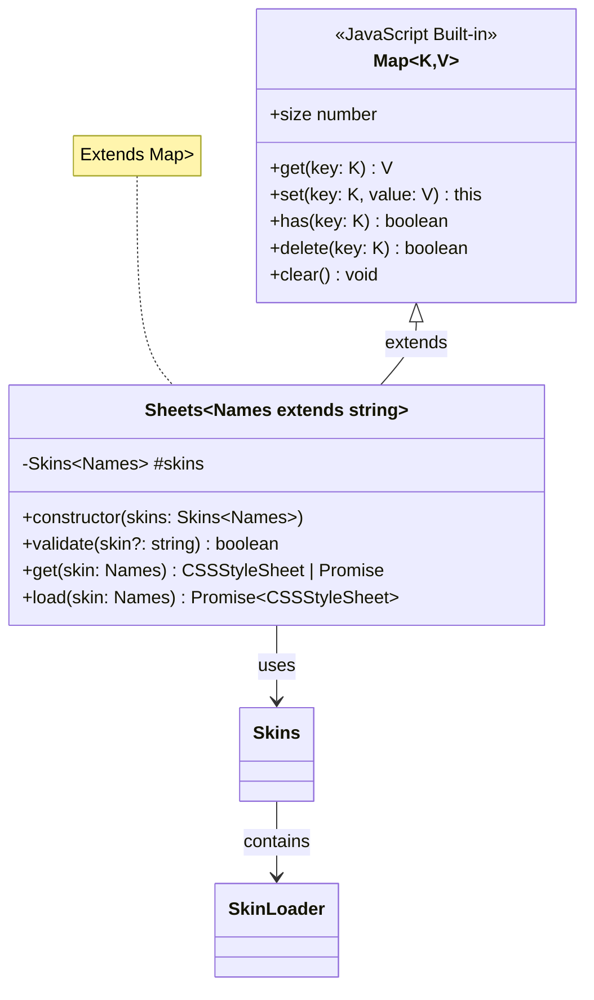
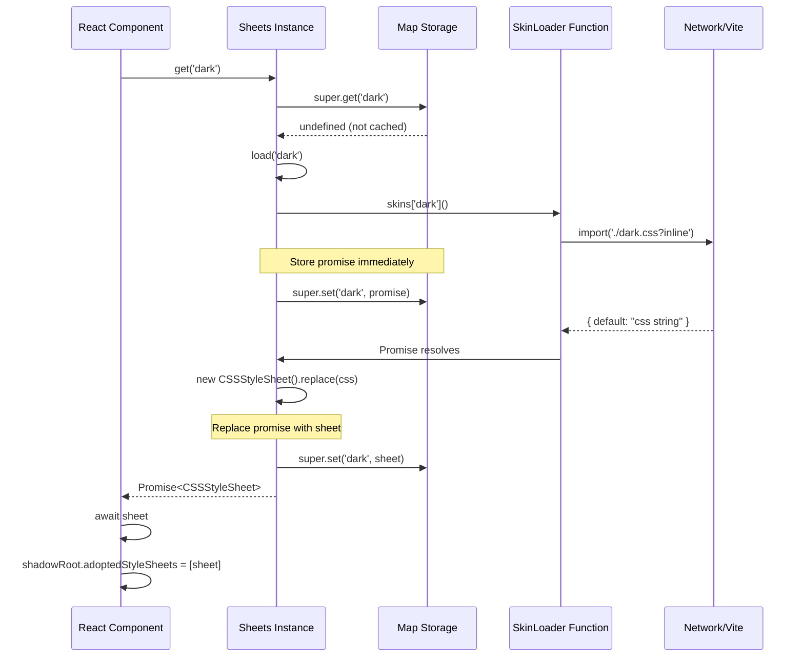
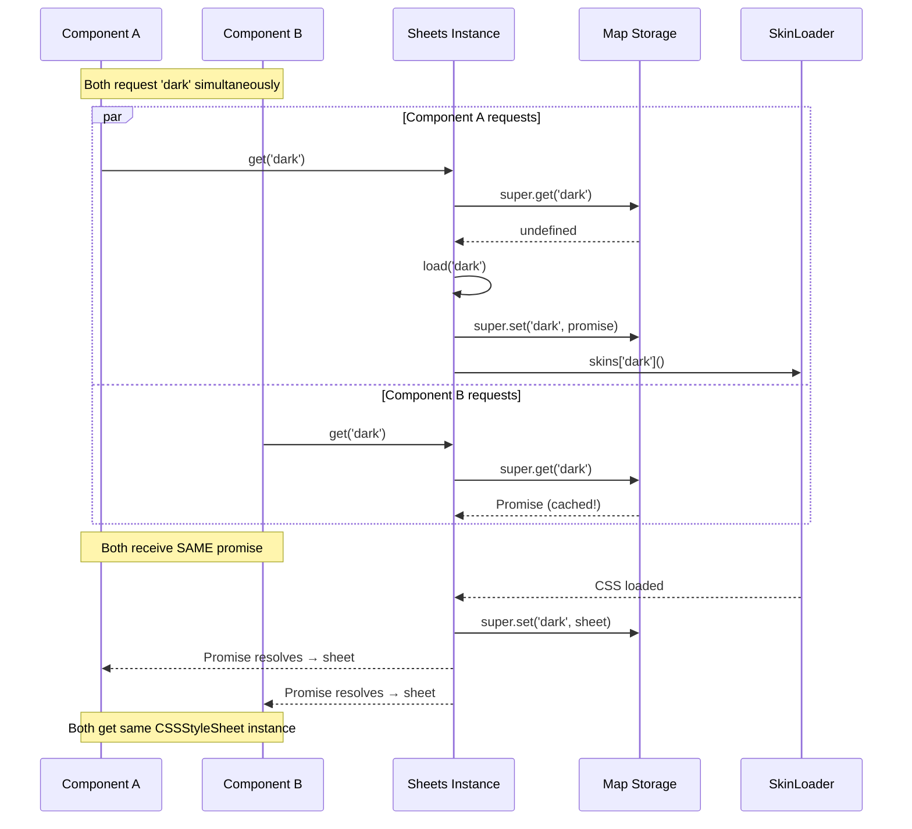

# Sheets - CSS Stylesheet Lifecycle Manager

## Overview

The `Sheets` class is a specialized `Map` subclass that manages the entire lifecycle of CSS stylesheets in the flesh-cage system. It handles lazy loading, promise coordination, caching, and validation of skin-based stylesheets for Shadow DOM components.

**Purpose:** Provide a centralized, efficient mechanism for loading CSS stylesheets on-demand while preventing duplicate network requests through intelligent caching and promise coordination.

**Lines of code:** 37 lines (36 lines of code + 1 blank line)

**Dependencies:** `../types` (imports `Skins` type)

**Dependents:**
- `../use-core/` - Consumes `Sheets` instances to load and adopt stylesheets
- `../styled/` - Creates `Sheets` instances from `StyledConfig`

## Philosophy & Design Decisions

### Why Extend `Map`?

The `Sheets` class extends the native JavaScript `Map` because:

1. **Natural fit:** Stylesheets are fundamentally a key-value store (skin name → stylesheet)
2. **Built-in methods:** Inherits `has()`, `delete()`, `clear()`, `size`, etc. for free
3. **Iteration support:** Can iterate over loaded sheets with `for...of`, `forEach()`, etc.
4. **Memory efficiency:** Map's internal hash table is optimized by browser engines
5. **Type safety:** Generic `Map<Names, CSSStyleSheet | Promise<CSSStyleSheet>>` provides strong typing

### The Promise Coordination Pattern

**Problem:** If two components request the same skin simultaneously, we don't want to trigger two network requests or two `CSSStyleSheet.replace()` calls.

**Solution:** Store the loading promise itself in the map during the load operation. Subsequent requests get the same promise, ensuring only one load happens.

```typescript
// First request: triggers load
const sheet1 = sheets.get('dark') // Returns Promise<CSSStyleSheet>

// Second request (before first completes): reuses promise
const sheet2 = sheets.get('dark') // Returns the SAME Promise<CSSStyleSheet>

// After load completes: returns cached sheet
const sheet3 = sheets.get('dark') // Returns CSSStyleSheet (resolved)
```

This pattern is critical for:
- **Performance:** Avoids redundant network requests
- **Consistency:** All components get the same stylesheet instance
- **Simplicity:** Calling code doesn't need to coordinate—it's automatic

### Why Private Fields?

The `#skins` field uses JavaScript private field syntax (`#`) instead of TypeScript's `private` keyword:

- **Runtime privacy:** Cannot be accessed even with `any` cast or bracket notation
- **Name collision prevention:** Private fields are guaranteed not to conflict with Map's internal properties
- **Future-proof:** Aligns with JavaScript standard rather than TypeScript-specific features

### Trade-offs

**Pros:**
- Zero duplication of stylesheets across components
- Automatic coordination of concurrent loads
- Type-safe skin name validation
- Minimal memory overhead (Map is efficient)

**Cons:**
- Stylesheets are never evicted from cache (no LRU, no TTL)
- No preloading mechanism (skins only load on first request)
- Validation happens at runtime, not compile-time
- Promise rejection handling is caller's responsibility

### Alternatives Considered

1. **Plain object cache:**
   - Rejected: No inheritance of Map utilities, no type safety

2. **Separate cache and loader:**
   - Rejected: More complex API, doesn't prevent duplicate loads as elegantly

3. **WeakMap for automatic GC:**
   - Rejected: Can't use strings as keys (must be objects)

4. **Service Worker cache:**
   - Rejected: Over-engineered, not available in all environments

## Architecture

### Class Structure



### Skin Loading Sequence



### Concurrent Request Coordination



## Code Walkthrough

### Class Declaration and Storage

```typescript
export class Sheets<Names extends string = string> extends Map<
  Names,
  CSSStyleSheet | Promise<CSSStyleSheet>
> {
  #skins: Skins<Names>
```

**Line-by-line:**

1. **`export class Sheets`**: Publicly exported for use in other modules
2. **`<Names extends string = string>`**: Generic type parameter constraining skin names to strings, with default for flexibility
3. **`extends Map<Names, CSSStyleSheet | Promise<CSSStyleSheet>>`**:
   - Keys are skin names (type `Names`)
   - Values are EITHER a loaded `CSSStyleSheet` OR a loading `Promise<CSSStyleSheet>`
   - This union type is the key to the promise coordination pattern
4. **`#skins: Skins<Names>`**: Private field storing the skin loader functions

**Critical invariant:** A map entry is a `Promise` during loading, then gets replaced with the resolved `CSSStyleSheet`. Never both simultaneously.

### Constructor

```typescript
constructor({ skins }: { skins: Skins<Names> }) {
  super()
  this.#skins = skins
}
```

**Why destructured parameter?**

Using `{ skins }` instead of `skins` enables future expansion (could add `{ skins, options, cache }` without breaking changes).

**Why call `super()`?**

Required when extending a class. Initializes the Map's internal storage.

**What happens here?**

1. Initialize Map storage (via `super()`)
2. Store the skin loaders for later use
3. Map starts empty—no stylesheets are preloaded

### Validation Method

```typescript
validate(skin?: string): skin is Names {
  return !!skin && Object.prototype.hasOwnProperty.call(this.#skins, skin)
}
```

**Line-by-line:**

1. **`skin?: string`**: Optional parameter (might be undefined or empty)
2. **`: skin is Names`**: TypeScript type predicate—if returns true, TypeScript knows `skin` is valid
3. **`!!skin`**: Coerce to boolean and check for truthiness (not undefined, null, or empty string)
4. **`Object.prototype.hasOwnProperty.call(this.#skins, skin)`**: Check if skin exists in the skins record

**Why `Object.prototype.hasOwnProperty.call()` instead of `this.#skins.hasOwnProperty()`?**

Defensive programming. If someone passes a `Skins` object with a `hasOwnProperty` property (unlikely but possible), the direct call would break. Using `call()` ensures we're using the built-in method.

**Type predicate in action:**
```typescript
const skin = getSkinFromProps()
if (sheets.validate(skin)) {
  // TypeScript knows 'skin' is type 'Names' here
  const sheet = sheets.get(skin) // No type error
}
```

### Get Method (Override)

```typescript
override get(skin: Names): CSSStyleSheet | Promise<CSSStyleSheet> {
  return super.get(skin) || this.load(skin)
}
```

**Why override `get()`?**

Map's default `get()` returns `undefined` for missing keys. We want to automatically trigger loading instead.

**Line-by-line:**

1. **`override`**: TypeScript keyword indicating we're replacing Map's `get()` method
2. **`super.get(skin)`**: Check if skin is already cached (either as sheet or promise)
3. **`|| this.load(skin)`**: If not cached, trigger load and return the loading promise
4. **Return type**: `CSSStyleSheet | Promise<CSSStyleSheet>` (caller must handle both cases)

**Why short-circuit with `||`?**

Performance. If the skin is cached, we return immediately without creating any new promises or function calls.

**Critical behavior:** This method is idempotent—calling it multiple times has the same effect as calling it once.

### Load Method

```typescript
load(skin: Names): Promise<CSSStyleSheet> {
  const { [skin]: load } = this.#skins
  const promise = load()
    .then(({ default: style }) => new CSSStyleSheet().replace(style))
    .then((sheet) => {
      super.set(skin, sheet)

      return sheet
    })

  super.set(skin, promise)

  return promise
}
```

**Line-by-line:**

1. **`const { [skin]: load } = this.#skins`**: Extract the loader function for this skin using destructuring with computed property

2. **`const promise = load()`**: Invoke the loader (starts the import)

3. **`.then(({ default: style }) => ...)`**: Extract the CSS string from the module's default export

4. **`new CSSStyleSheet().replace(style)`**: Create a new CSSStyleSheet and populate it with the CSS
   - `replace()` returns a Promise that resolves to the stylesheet
   - This promise resolves when CSS parsing completes

5. **`.then((sheet) => { super.set(skin, sheet); return sheet })`**:
   - Replace the promise in the map with the resolved stylesheet
   - Return the sheet for the promise chain

6. **`super.set(skin, promise)`**: **CRITICAL LINE** - Store the promise BEFORE it resolves
   - This is what enables concurrent request coordination
   - Must happen before returning

7. **`return promise`**: Return the loading promise to the caller

**Order matters:** The `super.set(skin, promise)` MUST happen before `return`. This ensures the promise is cached even if the caller doesn't await it immediately.

**Error handling:** If the promise rejects (network error, invalid CSS, etc.), the rejection stays in the map. Subsequent `get()` calls will return the rejected promise. This is intentional—we don't retry failed loads automatically.

### Caching Strategy

The `Sheets` class implements a **lazy, promise-aware, never-evicting cache**:

1. **Lazy:** Stylesheets load only when first requested, not at construction
2. **Promise-aware:** Stores promises during loading to coordinate concurrent requests
3. **Never-evicting:** Once loaded, stylesheets stay in memory forever (no LRU, no size limits)

**Cache states for a given skin:**

```
[Not in map] → get() → [Promise in map] → resolve → [CSSStyleSheet in map]
                            ↓
                        concurrent get() returns same promise
```

**Memory implications:**

- Each `CSSStyleSheet` object is ~1-50KB depending on CSS complexity
- 10 skins ≈ 10-500KB memory usage (negligible in modern browsers)
- Stylesheets are shared across all component instances (huge memory win)

**Why never evict?**

1. **Complexity:** LRU cache adds significant complexity
2. **Memory:** CSS is small—even 100 skins is <5MB
3. **Performance:** Never evicting means zero cache misses after initial load
4. **Simplicity:** Easier to reason about and debug

## Usage Examples

### Basic Usage

```typescript
import { Sheets } from '@everything-dies/flesh-cage/core/sheets'

const sheets = new Sheets({
  skins: {
    dark: () => import('./dark.css?inline'),
    light: () => import('./light.css?inline')
  }
})

// Validate a skin name
if (sheets.validate('dark')) {
  // Load the stylesheet
  const result = sheets.get('dark')

  if (result instanceof Promise) {
    const sheet = await result
    console.log('Sheet loaded:', sheet)
  } else {
    console.log('Sheet cached:', result)
  }
}
```

### Type-Safe Skin Names

```typescript
import { Sheets } from '@everything-dies/flesh-cage/core/sheets'
import type { Skins } from '@everything-dies/flesh-cage/core/types'

type ThemeSkins = 'dark' | 'light' | 'high-contrast'

const skins: Skins<ThemeSkins> = {
  'dark': () => import('./dark.css?inline'),
  'light': () => import('./light.css?inline'),
  'high-contrast': () => import('./high-contrast.css?inline')
}

const sheets = new Sheets<ThemeSkins>({ skins })

// TypeScript error if invalid skin name
// sheets.validate('invalid') // OK, but returns false
// sheets.get('invalid') // TypeScript error!
```

### Handling Load Errors

```typescript
const sheets = new Sheets({
  skins: {
    broken: () => import('./nonexistent.css?inline')
  }
})

try {
  const result = sheets.get('broken')
  const sheet = await result // Will throw
} catch (error) {
  console.error('Failed to load skin:', error)

  // Retry by removing from cache and loading again
  sheets.delete('broken')
  const retryResult = sheets.get('broken')
  await retryResult
}
```

### Preloading Skins

```typescript
const sheets = new Sheets({
  skins: {
    dark: () => import('./dark.css?inline'),
    light: () => import('./light.css?inline')
  }
})

// Preload all skins on app initialization
async function preloadSkins() {
  const skinNames = ['dark', 'light'] as const

  await Promise.all(
    skinNames.map(name => sheets.get(name))
  )

  console.log('All skins preloaded!')
}

preloadSkins()
```

### Shadow DOM Integration

```typescript
class MyComponent extends HTMLElement {
  constructor() {
    super()
    this.attachShadow({ mode: 'open' })
  }

  async connectedCallback() {
    const sheets = new Sheets({
      skins: { default: () => import('./styles.css?inline') }
    })

    const sheet = await sheets.get('default')

    // Adopt the stylesheet into shadow DOM
    this.shadowRoot!.adoptedStyleSheets = [sheet]

    this.shadowRoot!.innerHTML = '<div>Styled content</div>'
  }
}

customElements.define('my-component', MyComponent)
```

### Concurrent Request Coordination

```typescript
const sheets = new Sheets({
  skins: { heavy: () => import('./heavy.css?inline') } // 500KB file
})

// Three components mount simultaneously
async function mountComponents() {
  // All three requests happen at the same time
  const [sheet1, sheet2, sheet3] = await Promise.all([
    sheets.get('heavy'),
    sheets.get('heavy'),
    sheets.get('heavy')
  ])

  // All three receive the SAME CSSStyleSheet instance
  console.log(sheet1 === sheet2 && sheet2 === sheet3) // true

  // Only ONE network request was made
}
```

### Cache Inspection

```typescript
const sheets = new Sheets({
  skins: {
    dark: () => import('./dark.css?inline'),
    light: () => import('./light.css?inline')
  }
})

// Trigger some loads
sheets.get('dark')

// Inspect cache state
console.log('Cache size:', sheets.size) // 1
console.log('Has dark?', sheets.has('dark')) // true
console.log('Has light?', sheets.has('light')) // false

// Iterate over cached sheets
for (const [name, value] of sheets) {
  if (value instanceof Promise) {
    console.log(`${name}: loading...`)
  } else {
    console.log(`${name}: loaded`)
  }
}
```

## Related Modules

### Dependencies (Imports)
- **[`../types/`](../types/README.md)**: Imports `Skins` type for constructor parameter

### Dependents (Imported By)
- **[`../use-core/`](../use-core/README.md)**: Creates `Sheets` instances and calls `validate()` and `get()`
- **[`../styled/`](../styled/README.md)**: Instantiates `Sheets` with `StyledConfig.skins`

### Related Files
- **[`__tests__/sheets.test.ts`](./__tests__/sheets.test.ts)**: Direct unit tests for Sheets class
- **[`__tests__/caching.test.ts`](./__tests__/caching.test.ts)**: Tests for caching behavior and concurrent loads

## Testing Strategy

### What We Test

1. **Constructor:**
   - Accepts valid skins object
   - Initializes empty map
   - Stores skins reference

2. **validate() method:**
   - Returns true for valid skin names
   - Returns false for invalid/missing skin names
   - Handles undefined, null, empty string
   - Type predicate works correctly

3. **get() method:**
   - Returns cached stylesheet if already loaded
   - Returns loading promise if not yet loaded
   - Triggers load on first call
   - Returns same promise for concurrent requests

4. **load() method:**
   - Creates promise and caches it immediately
   - Calls the skin loader function
   - Creates CSSStyleSheet from CSS string
   - Replaces promise with stylesheet after load
   - Handles promise rejection

5. **Caching behavior:**
   - Concurrent loads of same skin share one promise
   - Each skin is loaded exactly once
   - Multiple skins cached independently
   - Stylesheets are never evicted

### Test File Organization

- **`sheets.test.ts`**: Direct unit tests of the Sheets class methods
- **`caching.test.ts`**: Integration tests for caching and concurrent request coordination

### Coverage Goals

- **Line coverage:** 100% (all 36 lines)
- **Branch coverage:** 100% (validation, cache hit/miss, promise/sheet)
- **Edge cases:** undefined skin, rejected promises, concurrent requests

### Test Utilities

Tests use:
- `createMockSkin(css)` from `../../__tests__/utils.ts` to create mock loaders
- `waitFor()` from `@testing-library/react` for async assertions
- Vitest's `describe`, `it`, `expect` for structure

## Common Pitfalls

### Pitfall 1: Not Awaiting get() Results

```typescript
// ❌ Wrong - result might be a promise
const sheet = sheets.get('dark')
shadowRoot.adoptedStyleSheets = [sheet] // Type error or runtime error

// ✅ Correct - handle both cases
const result = sheets.get('dark')
const sheet = result instanceof Promise ? await result : result
shadowRoot.adoptedStyleSheets = [sheet]
```

**Why it matters:** The first call to `get()` returns a Promise, subsequent calls return the cached CSSStyleSheet.

### Pitfall 2: Assuming Validation Prevents Load Errors

```typescript
// ❌ Wrong - validation doesn't prevent load failures
if (sheets.validate('dark')) {
  const sheet = await sheets.get('dark') // Might throw!
}

// ✅ Correct - always use try/catch
if (sheets.validate('dark')) {
  try {
    const sheet = await sheets.get('dark')
  } catch (error) {
    console.error('Load failed:', error)
  }
}
```

**Why it matters:** Validation only checks if the skin name exists in the config. The actual load can still fail (network error, invalid CSS, etc.).

### Pitfall 3: Forgetting ?inline Suffix

```typescript
// ❌ Wrong - imports CSS Module object, not string
const sheets = new Sheets({
  skins: {
    dark: () => import('./dark.css')
  }
})

// ✅ Correct - use ?inline to get raw CSS string
const sheets = new Sheets({
  skins: {
    dark: () => import('./dark.css?inline')
  }
})
```

**Why it matters:** Without `?inline`, Vite returns a CSS Module object (e.g., `{ default: { className: '_hash_123' } }`), not a CSS string. `CSSStyleSheet.replace()` expects a string.

### Pitfall 4: Modifying Map While Iterating

```typescript
// ❌ Wrong - modifying during iteration is undefined behavior
for (const [name] of sheets) {
  sheets.delete(name) // BAD
}

// ✅ Correct - collect keys first
const names = Array.from(sheets.keys())
for (const name of names) {
  sheets.delete(name)
}
```

**Why it matters:** Modifying a Map while iterating over it can cause skipped entries or infinite loops.

### Pitfall 5: Assuming Immediate Cache After load()

```typescript
// ❌ Wrong - promise might not be resolved yet
sheets.load('dark')
const sheet = sheets.get('dark') // Returns Promise, not CSSStyleSheet

// ✅ Correct - await the promise
await sheets.load('dark')
const sheet = sheets.get('dark') // Now returns CSSStyleSheet
```

**Why it matters:** `load()` returns a promise that resolves when loading completes. The promise is cached immediately, but the resolved sheet isn't available until the promise resolves.

## Future Enhancements

### Planned Improvements

1. **LRU eviction policy:**
   - Add configurable max cache size
   - Evict least-recently-used sheets when limit reached
   - Track access time for each sheet

2. **Preloading API:**
   ```typescript
   await sheets.preload(['dark', 'light'])
   ```

3. **Metrics and observability:**
   - Track hit/miss ratio
   - Measure load times
   - Report cache size

4. **Failed load retry:**
   - Automatic retry on network failure
   - Exponential backoff
   - Max retry configuration

5. **CSS validation:**
   - Optional schema validation of loaded CSS
   - Warn on missing required selectors
   - Development-mode CSS linting

6. **Subresource Integrity (SRI):**
   - Verify CSS content matches expected hash
   - Prevent tampering or corruption

### Breaking Changes Under Consideration

- **v2.0:** May add required `cache` option to constructor for configurable eviction
- **v2.0:** May change `load()` to return `{ sheet, loadTime }` instead of just sheet

## Maintainer Notes: If I Die Tomorrow

### Critical Invariants (DO NOT BREAK)

1. **Promise MUST be stored before returning from load():**
   ```typescript
   super.set(skin, promise) // MUST happen first
   return promise           // THEN return
   ```
   Breaking this order causes race conditions in concurrent loads.

2. **Never store both promise and sheet for same skin simultaneously:**
   The map value is EITHER a Promise (during load) OR a CSSStyleSheet (after load). Never both.

3. **validate() MUST use Object.prototype.hasOwnProperty.call():**
   Direct `this.#skins.hasOwnProperty()` call is unsafe if skins object is polluted.

4. **get() MUST return super.get() || this.load():**
   Changing to `if/else` breaks the auto-load behavior. The `||` short-circuit is intentional.

5. **load() MUST NOT call get():**
   Would create infinite recursion. `load()` is the primitive; `get()` is the convenience wrapper.

### Fragile Areas

1. **Promise chaining in load():**
   The two `.then()` calls must stay in this exact order:
   - First: Create stylesheet from CSS string
   - Second: Store stylesheet in map and return it

   Reordering breaks the cache-before-return invariant.

2. **CSSStyleSheet.replace() polyfill:**
   Tests rely on polyfill in `../../__tests__/setup.ts`. If polyfill breaks, all tests fail.

3. **Generic type constraints:**
   `Names extends string = string` enables both strict (`Sheets<'a' | 'b'>`) and loose (`Sheets`) usage. Removing the default breaks loose usage.

4. **Map inheritance:**
   Extending Map gives us iteration, `size`, `clear()`, etc. for free. Changing to composition loses these.

### Debugging Guide

#### Problem: "get() always returns Promise, never CSSStyleSheet"

**Likely cause:** Promise is resolving but not replacing itself in the map

**Fix:** Check that `super.set(skin, sheet)` is being called in the second `.then()` of `load()`

**Verification:**
```typescript
const result = await sheets.get('dark')
console.log(sheets.get('dark') instanceof Promise) // Should be false
```

#### Problem: "Multiple network requests for same skin"

**Likely cause:** Promise not being cached before return in `load()`

**Fix:** Ensure `super.set(skin, promise)` happens BEFORE `return promise`

**Verification:**
```typescript
// Add logging to load()
super.set(skin, promise)
console.log('Promise cached for:', skin)
return promise
```

#### Problem: "TypeScript error: Type 'string' is not assignable to type 'Names'"

**Likely cause:** Skin name is dynamic string, not literal type

**Fix:** Use type assertion or widen generic:
```typescript
const skinName: string = getSkinDynamically()
if (sheets.validate(skinName as Names)) {
  sheets.get(skinName as Names)
}
```

#### Problem: "CSSStyleSheet.replace() returns undefined instead of Promise"

**Likely cause:** Missing polyfill in test environment

**Fix:** Ensure `../../__tests__/setup.ts` is imported at top of test file

### When to Modify This File

**SAFE changes:**
- Add new methods that don't override Map methods (e.g., `preload()`, `clear()`)
- Add optional constructor parameters (with defaults)
- Improve error messages
- Add JSDoc comments

**BREAKING changes:**
- Change `get()` signature or return type
- Change `load()` signature or return type
- Change `validate()` signature or type predicate
- Remove Map inheritance
- Make constructor parameters required
- Change cache eviction behavior (if added)

**NEVER do:**
- Make `#skins` public (breaks encapsulation)
- Change load() to not cache the promise (breaks concurrency)
- Add synchronous loading mode (fundamentally incompatible)
- Store anything other than `CSSStyleSheet | Promise<CSSStyleSheet>` in map

### Performance Considerations

1. **Map.get() is O(1):** Hash table lookup is constant time
2. **Promise creation is cheap:** ~10-100 microseconds per promise
3. **CSSStyleSheet.replace() is expensive:** ~1-10ms for typical CSS
4. **Network request is most expensive:** 10-500ms depending on file size

**Optimization priorities:**
1. Minimize network requests (cache invalidation is not a concern)
2. Share stylesheets across components (already done via caching)
3. Avoid redundant CSSStyleSheet objects (already done via promise coordination)

### Memory Leak Potential

**Current implementation:** No memory leaks because:
- Stylesheets are intentionally never evicted
- Each stylesheet is created once and reused
- No event listeners or timers

**Future risk:** If LRU eviction is added, must ensure:
- Weak references to evicted sheets (allow GC)
- No dangling references in component shadow DOMs
- Clear eviction events for debugging

### Emergency Rollback

If this module causes production issues:

1. **Immediate fix:** Revert to previous commit
   ```bash
   git revert <this-commit-hash>
   ```

2. **Temporary workaround:** Inline skin loading in `use-core/` without caching
   ```typescript
   // In use-core/index.ts
   const sheet = await skinLoader().then(({ default: css }) =>
     new CSSStyleSheet().replace(css)
   )
   ```

3. **Diagnose:** Check browser console for errors, network tab for duplicate requests

4. **Test in isolation:**
   ```bash
   npm test -- sheets
   ```

### Related Documentation

- MDN: [CSSStyleSheet API](https://developer.mozilla.org/en-US/docs/Web/API/CSSStyleSheet)
- MDN: [Constructable Stylesheets](https://developer.mozilla.org/en-US/docs/Web/API/CSSStyleSheet/CSSStyleSheet)
- Specification: [CSS Typed OM](https://drafts.css-houdini.org/css-typed-om/)
- Pattern: [Promise Coordination Pattern](https://javascript.info/promise-basics)
