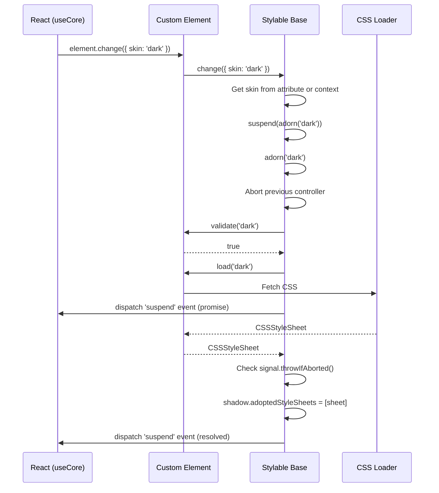
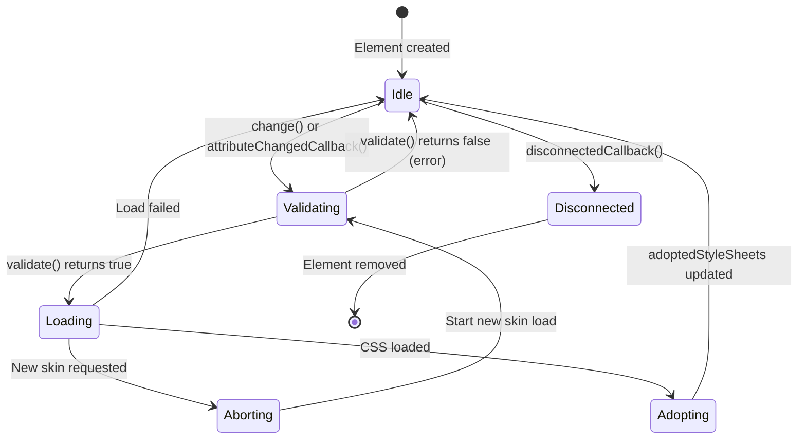

# Stylable - Abstract Base Class for Skin-Switching Custom Elements

## Overview

The `stylable/` module exports the `Stylable` abstract class, the foundation for all skin-switching custom elements in the flesh-cage system. It also exports a `verify` utility function for handling AbortError exceptions.

**Purpose:** Provide a reusable base class that handles Shadow DOM creation, skin validation, async CSS loading, AbortController-based cancellation, and Suspense integration via custom events.

**Lines of code:** 70 lines (1 utility function, 1 abstract class with 9 methods/properties)

**Complexity level:** HIGH - This is the core abstraction that all styled custom elements extend. Changes here affect every component in the system.

**Dependencies:**

- None (pure browser APIs)

**Dependents:**

- `../styled/` - Creates concrete implementations extending `Stylable`
- `../use-core/` - Imports `Stylable` type for ref typing
- User custom elements - Can extend `Stylable` directly

## Philosophy & Design Decisions

### Why an Abstract Class?

```typescript
export abstract class Stylable<
  Names extends string = string,
> extends HTMLElement {
  protected abstract validate(skin: Names): boolean
  protected abstract load(skin: Names): Promise<CSSStyleSheet> | CSSStyleSheet
}
```

**Decision:** Use an abstract class with abstract methods instead of a concrete class or interface.

**Rationale:**

1. **Shared implementation:** The class provides common functionality (Shadow DOM, AbortController, event dispatching) that all styled elements need. An interface can't provide implementation.

2. **Enforced contract:** Abstract methods `validate()` and `load()` force subclasses to implement skin validation and loading logic. This prevents incomplete implementations.

3. **Type safety:** Generics (`<Names extends string>`) provide compile-time validation of skin names.

4. **HTMLElement inheritance:** Custom elements must extend `HTMLElement`. By extending it in `Stylable`, subclasses get both HTMLElement functionality and our skin management.

**Rejected alternatives:**

- **Interface:** Can't share implementation code
- **Mixin:** More complex, harder to type correctly
- **Composition:** Would require custom elements to manage multiple objects

### Why AbortController for Cancellation?

```typescript
controller = new AbortController()

adorn = (skin: Names) => {
  const { controller: previous } = this
  const next = (this.controller = new AbortController())
  // ...
  previous.abort()
  // ...
}
```

**Decision:** Use `AbortController` to cancel in-flight skin loading when a new skin is requested.

**Rationale:**

1. **Race condition prevention:** If user rapidly switches skins (light → dark → light), we want to cancel the intermediate loads. Without cancellation, the final skin might not be the one the user expects.

2. **Standard API:** `AbortController` is the standard browser API for cancellation. Using it means we can integrate with `fetch()`, `AbortSignal`, and other standard APIs.

3. **Resource cleanup:** Aborting cancels network requests and cleans up resources, improving performance.

**Flow:**

1. User requests skin "light" → `adorn('light')` starts loading
2. User immediately requests skin "dark" → `adorn('dark')` aborts "light" load, starts "dark" load
3. "dark" load completes → styles applied
4. "light" load (if somehow still pending) would be rejected with `AbortError`

### Why Shadow DOM?

```typescript
shadow = this.attachShadow({ mode: 'open' })
```

**Decision:** Attach Shadow DOM in open mode for style encapsulation.

**Rationale:**

1. **Style isolation:** Styles inside Shadow DOM don't leak out, and external styles don't leak in. Each component is a styling island.

2. **adoptedStyleSheets:** Shadow DOM supports `adoptedStyleSheets`, allowing efficient style sheet sharing and dynamic updates.

3. **Open mode:** Allows parent components (like `useCore`) to access the shadow root for debugging and portal rendering.

### Why Suspense via Custom Events?

```typescript
suspend = (promise: Promise<unknown>) => {
  const detail = promise.finally(this.resume)
  const retrieve = () =>
    this.dispatchEvent(new CustomEvent('suspend', { detail }))
  return queueMicrotask(retrieve)
}
```

**Decision:** Dispatch custom 'suspend' events with promises to integrate with React Suspense.

**Rationale:**

1. **Decoupling:** Custom elements don't import React. By dispatching events, they remain framework-agnostic.

2. **Async coordination:** The promise in the event detail allows React's `useCore` hook to track loading state and integrate with `<Suspense>`.

3. **Microtask timing:** Using `queueMicrotask` ensures the event is dispatched after the current synchronous code completes, allowing proper ordering.

## Architecture

### Class Diagram

```mermaid
classDiagram
    class HTMLElement {
        +connectedCallback()
        +disconnectedCallback()
        +attributeChangedCallback()
    }

    class Stylable~Names~ {
        <<abstract>>
        +static observedAttributes: readonly ['skin']
        +controller: AbortController
        +shadow: ShadowRoot
        #validate(skin: Names): boolean*
        #load(skin: Names): Promise~CSSStyleSheet~ | CSSStyleSheet*
        +adorn(skin: Names): Promise~ShadowRoot | DOMException~
        +attributeChangedCallback(name, old, new)
        +change(context: {skin?: Names})
        +disconnectedCallback()
        +resume(): boolean
        +suspend(promise: Promise): void
    }

    HTMLElement <|-- Stylable

    class ConcreteElement {
        #validate(skin): boolean
        #load(skin): Promise~CSSStyleSheet~
    }

    Stylable <|-- ConcreteElement
```

### Skin Change Flow



### State Machine



## Code Walkthrough

### verify Function (Lines 1-4)

```typescript
export const verify = (error: Error) =>
  error instanceof DOMException && error.name === 'AbortError'
    ? Promise.resolve(error)
    : Promise.reject(error)
```

**Purpose:** Filter errors to distinguish AbortErrors (expected, non-fatal) from other errors (unexpected, should propagate).

**Logic:**

1. Check if error is a `DOMException` with name `'AbortError'`
2. If yes: Resolve with the error (skin change was cancelled, that's OK)
3. If no: Reject with the error (real error, should propagate)

**Usage:** Called in the `.catch()` handler of `adorn()` to swallow AbortErrors from cancelled skin loads.

### Class Declaration (Lines 6-8)

```typescript
export abstract class Stylable<
  Names extends string = string,
> extends HTMLElement {
```

**Generic type:** `Names` constrains valid skin names. Default is `string` (any skin name). Subclasses can narrow this to specific literals like `'light' | 'dark'`.

**Inheritance:** Extends `HTMLElement` to be a valid custom element.

### Static Properties (Line 9)

```typescript
static observedAttributes = ['skin'] as const
```

**Purpose:** Tell the browser which attributes trigger `attributeChangedCallback()`.

**Value:** Only `'skin'` is observed. Changes to other attributes are ignored.

**`as const`:** Makes the array readonly and literal-typed for TypeScript.

### Instance Properties (Lines 11-13)

```typescript
controller = new AbortController()
shadow = this.attachShadow({ mode: 'open' })
```

**controller:** AbortController for cancelling in-flight skin loads. Replaced on each `adorn()` call.

**shadow:** ShadowRoot created immediately in open mode. Children render into this shadow root via React portals.

### Abstract Methods (Lines 15-17)

```typescript
protected abstract validate(skin: Names): boolean
protected abstract load(skin: Names): Promise<CSSStyleSheet> | CSSStyleSheet
```

**validate:** Subclasses implement this to check if a skin name is valid. Returns `true` if valid, `false` otherwise.

**load:** Subclasses implement this to load CSS for a skin. Can return a `CSSStyleSheet` directly or a `Promise` for async loading.

**protected:** Only accessible within the class and subclasses, not from outside.

### adorn Method (Lines 19-36)

```typescript
adorn = (skin: Names) => {
  const { controller: previous } = this
  const next = (this.controller = new AbortController())
  const invalid = !this.validate(skin)
  const adopt = (sheet: CSSStyleSheet) => {
    next.signal.throwIfAborted()
    return Object.assign(this.shadow, { adoptedStyleSheets: [sheet] })
  }

  previous.abort()

  return new Promise<CSSStyleSheet>((resolve, reject) =>
    invalid ? reject(new Error('Invalid skin')) : resolve(this.load(skin))
  )
    .then(adopt)
    .catch(verify)
}
```

**Line-by-line:**

1. Save previous controller, create new one
2. Validate the skin name
3. Define `adopt` function to apply styles (checks abort first)
4. Abort previous load (cancels any in-flight request)
5. Create promise that rejects if invalid, otherwise calls `load()`
6. On success, call `adopt()` to apply styles
7. On error, call `verify()` to filter AbortErrors

**Return type:** `Promise<ShadowRoot | DOMException>` - Either the shadow root with styles, or an AbortError if cancelled.

### attributeChangedCallback (Lines 38-47)

```typescript
attributeChangedCallback(
  name: (typeof Stylable.observedAttributes)[number],
  _: string,
  skin: string
) {
  switch (true) {
    case name.trim().toLowerCase() === 'skin':
      return this.suspend(this.adorn(skin as Names))
  }
}
```

**Purpose:** Handle `skin` attribute changes (e.g., `<my-element skin="dark">`).

**Parameters:**

- `name`: Attribute name that changed
- `_`: Old value (ignored)
- `skin`: New value

**Logic:** If the attribute is `'skin'`, call `suspend(adorn(skin))` to load and apply the new skin.

### change Method (Lines 49-55)

```typescript
change = (context: { skin?: Names }) => {
  const skin = (this.getAttribute('skin') ?? context.skin ?? '')
    .trim()
    .toLowerCase() as Names

  return this.suspend(this.adorn(skin))
}
```

**Purpose:** Called by `useCore` when React Context skin changes.

**Skin resolution order:**

1. `skin` attribute on the element (highest priority)
2. `skin` from context object (from Provider)
3. Empty string (fallback)

**Why this order?** Allows individual elements to override the Provider's skin via attributes.

### disconnectedCallback (Lines 57-59)

```typescript
disconnectedCallback() {
  this.shadow.adoptedStyleSheets = []
}
```

**Purpose:** Clean up when element is removed from DOM.

**Action:** Clear adopted stylesheets to release references and allow garbage collection.

### resume and suspend Methods (Lines 61-69)

```typescript
resume = () => this.dispatchEvent(new CustomEvent('suspend'))

suspend = (promise: Promise<unknown>) => {
  const detail = promise.finally(this.resume)
  const retrieve = () =>
    this.dispatchEvent(new CustomEvent('suspend', { detail }))

  return queueMicrotask(retrieve)
}
```

**suspend:** Wraps a promise and dispatches 'suspend' events for Suspense integration.

1. Attach `resume()` to promise's `finally()` handler
2. Dispatch 'suspend' event with promise in detail (via microtask for timing)

**resume:** Dispatch 'suspend' event without detail to signal loading complete.

**Why microtask?** Ensures event is dispatched after synchronous code completes, allowing `useCore` to set up its listener first.

## Usage Examples

### Extending Stylable

```typescript
import { Stylable } from '@everything-dies/flesh-cage/core/stylable'

type SkinName = 'light' | 'dark' | 'high-contrast'

class ThemedButton extends Stylable<SkinName> {
  private skins = new Map<SkinName, () => Promise<{ default: string }>>([
    ['light', () => import('./skins/light.css')],
    ['dark', () => import('./skins/dark.css')],
    ['high-contrast', () => import('./skins/high-contrast.css')],
  ])

  protected validate(skin: SkinName): boolean {
    return this.skins.has(skin)
  }

  protected async load(skin: SkinName): Promise<CSSStyleSheet> {
    const loader = this.skins.get(skin)!
    const module = await loader()
    const sheet = new CSSStyleSheet()
    await sheet.replace(module.default)
    return sheet
  }
}

customElements.define('themed-button', ThemedButton)
```

### Using verify for Error Handling

```typescript
import { verify } from '@everything-dies/flesh-cage/core/stylable'

async function loadSkinSafely(element: Stylable, skin: string) {
  try {
    await element.adorn(skin)
    console.log('Skin loaded successfully')
  } catch (error) {
    // verify already filtered AbortErrors in adorn()
    // This catch only receives real errors
    console.error('Failed to load skin:', error)
  }
}
```

### Handling Rapid Skin Changes

```typescript
const button = document.querySelector('themed-button')

// Rapid skin changes - only the last one should apply
button.change({ skin: 'light' }) // Started, then aborted
button.change({ skin: 'dark' }) // Started, then aborted
button.change({ skin: 'high-contrast' }) // This one completes

// After all promises settle, adoptedStyleSheets contains high-contrast styles
```

## Testing Strategy

Tests should be located in `stylable/__tests__/stylable.test.ts`.

### Test Categories

1. **verify function:**
   - Returns resolved promise for AbortError
   - Returns rejected promise for other DOMExceptions
   - Returns rejected promise for regular Errors

2. **Stylable class instantiation:**
   - Creates shadow root on construction
   - Has AbortController instance
   - observedAttributes contains 'skin'

3. **adorn method:**
   - Calls validate with skin name
   - Rejects if validate returns false
   - Calls load if validate returns true
   - Applies stylesheet to shadow DOM
   - Aborts previous load on new request
   - Handles AbortError gracefully

4. **change method:**
   - Reads skin from attribute first
   - Falls back to context.skin
   - Calls suspend with adorn promise

5. **Lifecycle methods:**
   - disconnectedCallback clears stylesheets
   - attributeChangedCallback triggers adorn

6. **suspend/resume:**
   - Dispatches 'suspend' event with promise
   - Dispatches 'suspend' event on completion

## Common Pitfalls

### 1. Forgetting to Implement Abstract Methods

**Problem:** Subclass doesn't implement `validate()` or `load()`.

```typescript
// ❌ BAD: Missing abstract method implementations
class BrokenElement extends Stylable {
  // TypeScript error: Non-abstract class 'BrokenElement' does not implement
  // inherited abstract member 'validate' from class 'Stylable'.
}
```

**Solution:** Always implement both abstract methods.

```typescript
// ✅ GOOD: All abstract methods implemented
class WorkingElement extends Stylable {
  protected validate(skin: string) {
    return true
  }
  protected load(skin: string) {
    return new CSSStyleSheet()
  }
}
```

### 2. Not Handling AbortErrors

**Problem:** Treating AbortError as a real failure.

```typescript
// ❌ BAD: Logging AbortErrors as failures
element.adorn('dark').catch((error) => {
  console.error('Skin load failed:', error) // Logs AbortErrors too
})
```

**Solution:** The `verify` function already handles this inside `adorn()`. AbortErrors won't reach your catch handler.

### 3. Accessing Shadow DOM Before Construction

**Problem:** Trying to use `this.shadow` in subclass constructor before `super()`.

```typescript
// ❌ BAD: Accessing shadow before super()
class BadElement extends Stylable {
  constructor() {
    this.shadow.innerHTML = '<slot></slot>' // Error: 'this' not available
    super()
  }
}
```

**Solution:** Call `super()` first, then access `this.shadow`.

```typescript
// ✅ GOOD: super() called first
class GoodElement extends Stylable {
  constructor() {
    super()
    this.shadow.innerHTML = '<slot></slot>'
  }
}
```

### 4. Returning Wrong Type from load()

**Problem:** Returning CSS string instead of CSSStyleSheet.

```typescript
// ❌ BAD: Returns string, not CSSStyleSheet
protected load(skin: string) {
  return '.button { color: red }' // Wrong type!
}
```

**Solution:** Create and return a `CSSStyleSheet`.

```typescript
// ✅ GOOD: Returns CSSStyleSheet
protected async load(skin: string) {
  const css = await fetch(`/skins/${skin}.css`).then(r => r.text())
  const sheet = new CSSStyleSheet()
  await sheet.replace(css)
  return sheet
}
```

### 5. Memory Leaks from Event Listeners

**Problem:** Adding listeners in `connectedCallback` without removing in `disconnectedCallback`.

```typescript
// ❌ BAD: Listener never removed
connectedCallback() {
  window.addEventListener('resize', this.handleResize)
}
```

**Solution:** Clean up in `disconnectedCallback`.

```typescript
// ✅ GOOD: Listener removed on disconnect
connectedCallback() {
  window.addEventListener('resize', this.handleResize)
}

disconnectedCallback() {
  super.disconnectedCallback() // Don't forget to call super!
  window.removeEventListener('resize', this.handleResize)
}
```

## Maintainer Notes: If I Die Tomorrow

### Critical Invariants

1. **Shadow DOM must exist:** The `shadow` property must always be a valid `ShadowRoot`. Never set it to `null` or reassign it.

2. **AbortController must be replaced atomically:** In `adorn()`, the new controller must be assigned before calling `previous.abort()`. This prevents race conditions.

3. **verify must filter only AbortErrors:** Don't expand `verify` to catch other errors. Only `AbortError` from `DOMException` should be swallowed.

4. **Abstract methods must remain abstract:** Don't provide default implementations. Subclasses must explicitly define their skin validation and loading logic.

### Fragile Areas

1. **Type assertion in attributeChangedCallback:** The `skin as Names` cast assumes the attribute value is valid. Invalid values will fail in `validate()`.

2. **Microtask timing in suspend:** Changing from `queueMicrotask` to `setTimeout` or synchronous dispatch will break the event ordering with `useCore`.

3. **adoptedStyleSheets assignment:** Using `Object.assign` instead of direct assignment is intentional (returns the shadow root). Don't change to `this.shadow.adoptedStyleSheets = [sheet]` without updating return type.

### Debugging Guide

**Styles not applying:**

1. Check `element.shadow.adoptedStyleSheets` - should have one sheet
2. Check `validate()` return value - should be `true`
3. Check `load()` return value - should be `CSSStyleSheet`

**Rapid skin changes fail:**

1. Check AbortController is being replaced correctly
2. Check `signal.throwIfAborted()` is being called before style adoption
3. Verify `verify()` is in the catch chain

**Events not dispatched:**

1. Check `queueMicrotask` is being called
2. Verify event listeners are attached before `change()` is called
3. Check for errors in `adorn()` that might prevent `suspend()` from being called

### Performance Considerations

- **CSSStyleSheet creation:** Creating sheets is cheap, but `replace()` is async. Cache sheets when possible.
- **AbortController overhead:** Creating new controllers on each `adorn()` is negligible.
- **Event dispatch:** Custom events have minimal overhead. No optimization needed.
