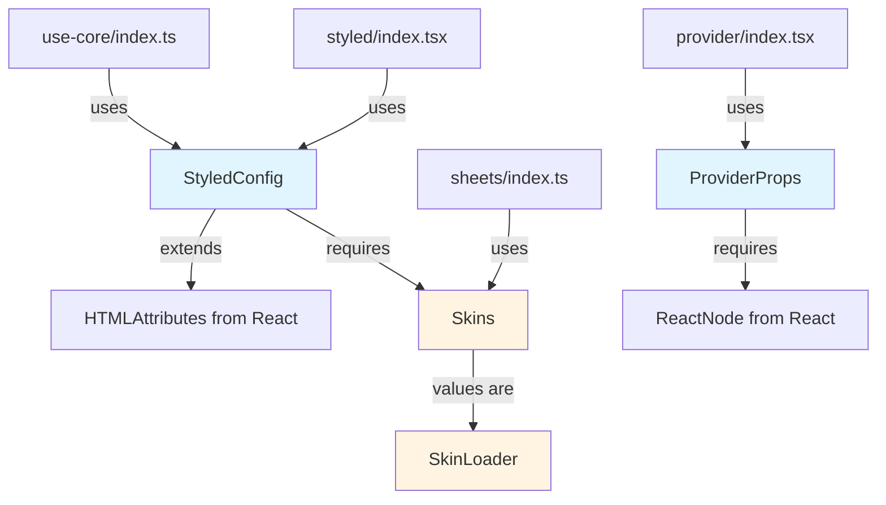
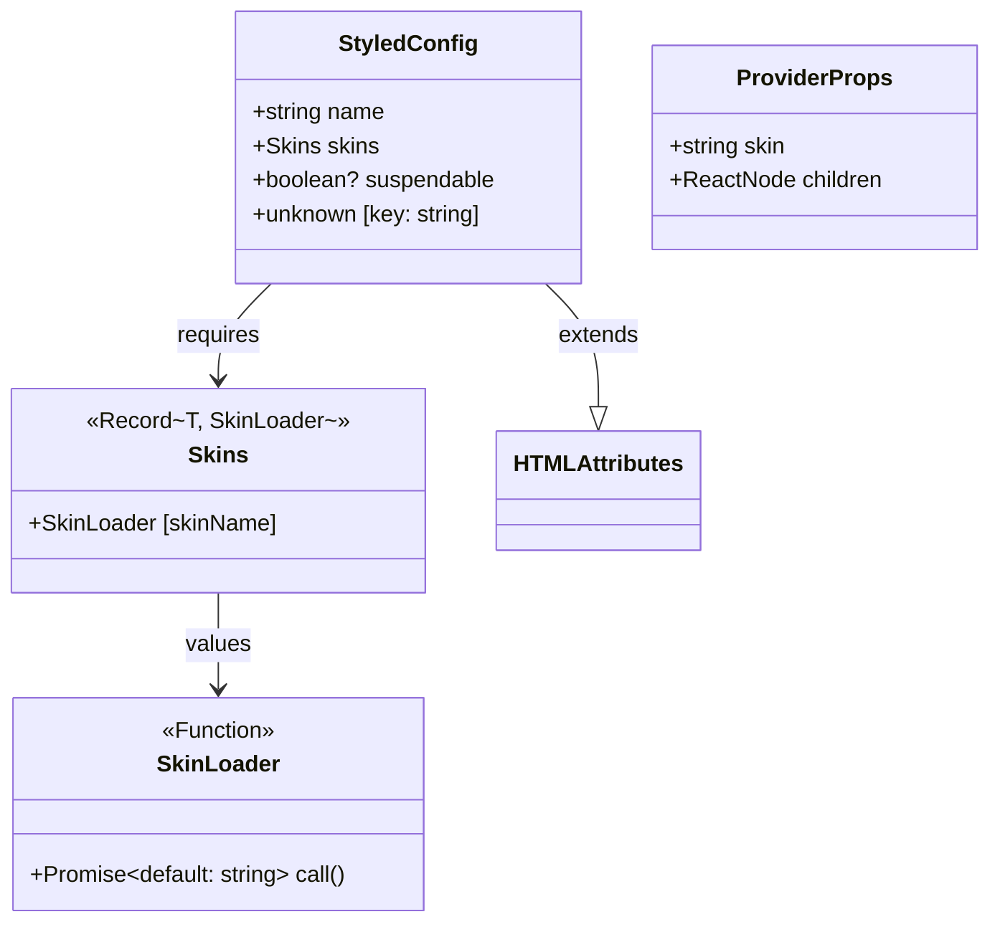

# Core Types

## Overview

The `types/` module defines the fundamental TypeScript interfaces and type aliases that form the contract layer for the entire `@everything-dies/flesh-cage/core` system. These types ensure type safety across the styled component factory, provider context, skin loading mechanism, and stylesheet management.

**Purpose:** Establish a single source of truth for all type definitions used throughout the core module, enabling strong TypeScript guarantees and IDE autocomplete across the codebase.

**Lines of code:** 41 lines (40 lines of types + 1 blank line)

**Dependencies:** Only imports from `react` (no internal dependencies)

**Dependents:** Every other module in `core/` imports from this module

## Philosophy & Design Decisions

### Why a Separate Types Module?

1. **Dependency Inversion:** By extracting types into their own module, we prevent circular dependencies. Other modules can import types without importing implementation.

2. **Single Source of Truth:** All type definitions live in one place, making it easy to understand the contracts at a glance.

3. **Composition over Inheritance:** Types extend built-in interfaces (`HTMLAttributes`) rather than creating complex inheritance hierarchies.

4. **Generic Constraints:** The `Names extends string` pattern allows type-safe skin names while preserving flexibility.

### Trade-offs

- **Pro:** Zero runtime overhead (types are erased at compile time)
- **Pro:** Excellent IDE support and autocomplete
- **Pro:** Prevents entire classes of runtime errors
- **Con:** Adds complexity for developers unfamiliar with TypeScript generics
- **Con:** Type definitions must be kept in sync with runtime behavior

### Alternatives Considered

- **JSDoc types:** Rejected because they don't provide compile-time guarantees
- **Runtime validation (Zod, io-ts):** Rejected for core types because they add bundle size; validation happens at the `Sheets` class level instead
- **Separate type files per module:** Rejected because it creates import complexity

## Architecture

### Type Dependency Graph



### Type Relationships



## Code Walkthrough

### Import Dependencies

```typescript
import type { HTMLAttributes, ReactNode } from 'react'
```

**Why `type` imports?** Using `import type` ensures these imports are erased at runtime, reducing bundle size and preventing circular dependency issues.

### StyledConfig Interface

```typescript
export interface StyledConfig<Names extends string = string> extends Partial<
  HTMLAttributes<HTMLElement>
> {
  name: string
  skins: Skins<Names>
  suspendable?: boolean
  // Allow arbitrary attributes (data-*, aria-*, etc.)
  [key: string]: unknown
}
```

**Line-by-line analysis:**

1. **`<Names extends string = string>`**: Generic type parameter that constrains skin names to string literals. The default `string` makes the generic optional.

2. **`extends Partial<HTMLAttributes<HTMLElement>>`**: Inherits all valid HTML attributes (id, className, style, data-_, aria-_, etc.). `Partial` makes all inherited properties optional.

3. **`name: string`**: The custom element tag name (e.g., "my-button"). Required. Must be unique per component.

4. **`skins: Skins<Names>`**: A record mapping skin names to lazy loader functions. Required. Enables the theming system.

5. **`suspendable?: boolean`**: Optional flag enabling React Suspense integration. When true, components suspend during async skin loading instead of throwing errors.

6. **`[key: string]: unknown`**: Index signature allowing arbitrary attributes. Critical for forwarding `data-*`, `aria-*`, and other custom attributes to the custom element.

**Critical invariant:** The `name` must be a valid custom element tag name (contain a hyphen, start with lowercase letter, no uppercase letters).

### SkinLoader Type Alias

```typescript
export type SkinLoader = () => Promise<{ default: string }>
```

**Why this signature?**

- **Function type:** Enables lazy evaluation—skins aren't loaded until requested
- **Promise return:** Supports async imports (`import('./styles.css?inline')`)
- **`{ default: string }` shape:** Matches ES module default export structure from Vite's `?inline` suffix
- **`string` payload:** The CSS content to inject into the shadow DOM

**Example usage:**

```typescript
const skins = {
  dark: () => import('./dark.css?inline'),
  light: () => import('./light.css?inline'),
}
```

### Skins Type Alias

```typescript
export type Skins<T extends string = string> = Record<T, SkinLoader>
```

**Why `Record<T, SkinLoader>`?**

- **`Record` utility:** Creates an object type with specified keys and values
- **`T extends string`:** Generic parameter allows literal types for autocomplete
- **Type-safe skin access:** TypeScript knows which skin names are valid

**Example with literal types:**

```typescript
type MySkins = Skins<'dark' | 'light'>
// TypeScript knows only 'dark' and 'light' are valid keys
```

**Example with generic strings:**

```typescript
type AnySkins = Skins
// Accepts any string key
```

### ProviderProps Interface

```typescript
export interface ProviderProps {
  /**
   * The skin to apply to all descendant components
   */
  skin: string

  /**
   * Children components
   */
  children: ReactNode
}
```

**Why separate from StyledConfig?**

- **Different concerns:** `ProviderProps` is for the React component tree; `StyledConfig` is for component definition
- **Simpler contract:** Provider only needs to know the active skin name and children
- **No HTML attributes:** Provider is a logical component, not a DOM element

**Critical invariant:** The `skin` value must match a key in the descendant component's `skins` record, or validation will fail.

## Usage Examples

### Basic Component Definition

```typescript
import { styled } from '@everything-dies/flesh-cage/core'
import type { StyledConfig } from '@everything-dies/flesh-cage/core/types'

const config: StyledConfig = {
  name: 'my-button',
  skins: {
    primary: () => import('./primary.css?inline'),
    secondary: () => import('./secondary.css?inline'),
  },
}

const Button = styled(config)
```

### With Literal Type Safety

```typescript
import type {
  StyledConfig,
  Skins,
} from '@everything-dies/flesh-cage/core/types'

type ButtonSkins = 'primary' | 'secondary' | 'danger'

const skins: Skins<ButtonSkins> = {
  primary: () => import('./primary.css?inline'),
  secondary: () => import('./secondary.css?inline'),
  danger: () => import('./danger.css?inline'),
  // TypeScript error if you add an unlisted skin
}

const config: StyledConfig<ButtonSkins> = {
  name: 'my-button',
  skins,
}
```

### With HTML Attributes

```typescript
const config: StyledConfig = {
  name: 'my-icon',
  skins: { default: () => import('./icon.css?inline') },
  role: 'img',
  'aria-label': 'Icon',
  'data-testid': 'icon-component',
}
```

### With Suspense

```typescript
const config: StyledConfig = {
  name: 'async-component',
  skins: {
    heavy: () => import('./heavy.css?inline') // Large CSS file
  },
  suspendable: true // Enable React Suspense
}

// Usage:
<Suspense fallback={<Spinner />}>
  <AsyncComponent />
</Suspense>
```

### Provider Usage

```typescript
import { Provider } from '@everything-dies/flesh-cage/core'
import type { ProviderProps } from '@everything-dies/flesh-cage/core/types'

const App = () => {
  const props: ProviderProps = {
    skin: 'dark',
    children: <MyComponent />
  }

  return <Provider {...props} />
}
```

## Related Modules

### Dependencies (Imports)

- **`react`**: For `HTMLAttributes` and `ReactNode` types

### Dependents (Imported By)

- **[`../sheets/`](../sheets/README.md)**: Uses `Skins<Names>` in the `Sheets` class constructor
- **[`../use-core/`](../use-core/README.md)**: Uses `StyledConfig` to validate and load skins
- **[`../provider/`](../provider/README.md)**: Uses `ProviderProps` for component props
- **[`../styled/`](../styled/README.md)**: Uses `StyledConfig` as the factory function parameter
- **[`../context/`](../context/README.md)**: Uses types indirectly through other modules

## Testing Strategy

### What We Test

1. **Type assignability:** Ensure valid configurations type-check correctly
2. **Type errors:** Verify invalid configurations are rejected at compile-time
3. **Generic constraints:** Test that skin name literals provide autocomplete
4. **Index signature compatibility:** Verify arbitrary attributes are allowed

### How We Test

Type tests use the pattern:

```typescript
expectType<StyledConfig>({
  /* valid config */
}) // Should compile
expectType<StyledConfig>({
  /* invalid config */
}) // Should error
```

See [`__tests__/types.test.ts`](./__tests__/types.test.ts) for full test suite.

### Coverage Goals

- All exported types have at least 3 positive test cases (valid usage)
- All exported types have at least 2 negative test cases (invalid usage caught)
- Generic type parameters tested with both literal and generic strings

## Common Pitfalls

### Pitfall 1: Forgetting the Hyphen in Custom Element Names

```typescript
// ❌ Invalid - no hyphen
const config: StyledConfig = {
  name: 'button', // Will cause runtime error
  skins: {
    /* ... */
  },
}

// ✅ Valid
const config: StyledConfig = {
  name: 'my-button',
  skins: {
    /* ... */
  },
}
```

**Why it matters:** Custom elements MUST contain a hyphen to avoid conflicts with future HTML standards.

### Pitfall 2: Mismatched Skin Names

```typescript
const config: StyledConfig<'dark' | 'light'> = {
  name: 'my-component',
  skins: {
    dark: () => import('./dark.css?inline'),
    lite: () => import('./light.css?inline'), // ❌ Typo: 'lite' instead of 'light'
  },
}
```

**Fix:** Use literal types for autocomplete and typo prevention.

### Pitfall 3: Incorrect SkinLoader Signature

```typescript
// ❌ Wrong return type
const skins = {
  dark: () => import('./dark.css'), // Returns { default: CSS Module object }
}

// ✅ Correct - use ?inline suffix
const skins = {
  dark: () => import('./dark.css?inline'), // Returns { default: string }
}
```

**Why it matters:** Vite's `?inline` suffix is required to get raw CSS strings instead of CSS Modules.

### Pitfall 4: Missing suspendable with Suspense

```typescript
// ❌ Component will throw during loading instead of suspending
const config: StyledConfig = {
  name: 'my-component',
  skins: { heavy: () => import('./heavy.css?inline') }
  // Missing: suspendable: true
}

// Usage with Suspense won't work as expected
<Suspense fallback={<Spinner />}>
  <MyComponent /> {/* Throws instead of suspending */}
</Suspense>
```

## Future Enhancements

### Planned Improvements

1. **Runtime validation helpers:** Add Zod schemas for config validation in development mode
2. **Builder pattern:** Type-safe fluent API for constructing `StyledConfig`
3. **Branded types:** Use TypeScript branded types to enforce custom element naming rules at compile-time
4. **Skin constraints:** Add ability to mark certain skins as required vs. optional

### Potential Breaking Changes

- **v2.0:** May add required `version` field to `StyledConfig` for migration compatibility
- **v2.0:** May split `suspendable` into `loadingStrategy: 'throw' | 'suspend' | 'fallback'`

## Maintainer Notes: If I Die Tomorrow

### Critical Invariants (DO NOT BREAK)

1. **All types MUST remain exported:** Other packages depend on these types. Removing exports is a breaking change.

2. **`StyledConfig.name` MUST be `string`, not `string literal union`:** Custom elements can have any valid name. Don't over-constrain this type.

3. **`SkinLoader` return type MUST match Vite's `?inline` export shape:** Changing this breaks all skin imports.

4. **`[key: string]: unknown` index signature is CRITICAL:** Removing this breaks forwarding of `data-*`, `aria-*`, and other attributes.

5. **Generic defaults (`= string`) are NOT optional:** They enable gradual typing—strict when needed, flexible by default.

### Fragile Areas

1. **React type imports:** If React changes `HTMLAttributes` or `ReactNode`, this breaks. Pin React types version in package.json.

2. **Generic variance:** TypeScript's structural typing means `StyledConfig<'a' | 'b'>` is assignable to `StyledConfig<string>`, but NOT vice versa. Be careful with generic constraints in dependent modules.

### Debugging Guide

#### Problem: "Type 'X' is not assignable to type 'StyledConfig'"

**Likely cause:** Missing required property (`name` or `skins`)

**Fix:** Ensure both `name` and `skins` are present in the config object

#### Problem: "Type 'Y' is not assignable to type 'Skins'"

**Likely cause:** Skin loader has wrong signature (returns wrong type)

**Fix:** Ensure all skin loaders return `Promise<{ default: string }>`, usually via `import('./file.css?inline')`

#### Problem: "Property 'X' does not exist on type 'StyledConfig'"

**Likely cause:** Trying to access a skin name that TypeScript doesn't know about

**Fix:** Either add the skin to the literal type union, or use non-literal `string` type

### When to Modify This File

- **Add a new required field:** Requires careful migration plan. Add as optional first, then make required in next major version.
- **Add a new optional field:** Safe to add anytime.
- **Remove a field:** BREAKING CHANGE. Requires major version bump.
- **Change a field type:** BREAKING CHANGE unless strictly widening (e.g., `string` → `string | number`).

### Emergency Contacts

- **TypeScript expert:** Check git blame for latest type changes
- **React integration:** Check `provider/` and `use-core/` modules
- **Vite/build integration:** Check how `?inline` imports work in `sheets/` module
