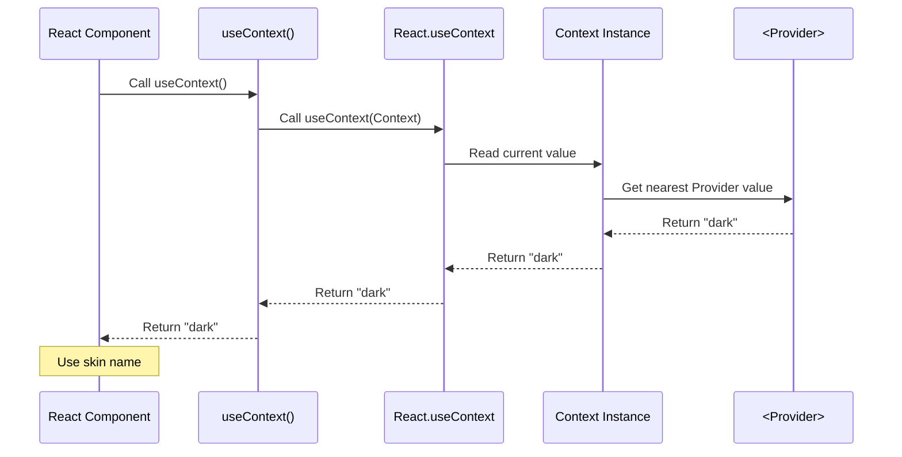
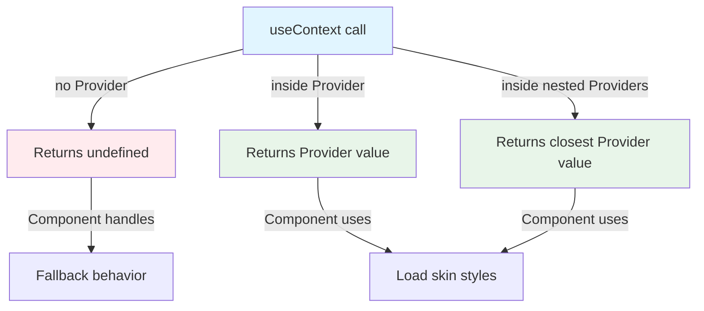

# useContext - Type-Safe Context Consumption Hook

## Overview

The `use-context/` module exports a custom React hook that wraps the flesh-cage Context, providing a clean, type-safe API for consuming skin names within styled components. This hook eliminates the need to import both React's `useContext` and the `Context` instance separately.

**Purpose:** Simplify Context consumption with a pre-configured hook that's specific to the flesh-cage theming system, reducing boilerplate and potential import errors.

**Lines of code:** 5 lines (2 imports, 1 hook function, 2 blank lines)

**Dependencies:**

- `react` - For the base `useContext` hook
- `../context/` - For the Context instance to consume

**Dependents:**

- `../use-core/` - Uses this hook to read the active skin name
- User code - Can use this hook directly in components

## Philosophy & Design Decisions

### Why a Custom Hook?

React provides `useContext(Context)` out of the box, so why create a wrapper?

1. **Convenience:** One import instead of two

   ```typescript
   // ❌ Without wrapper
   import { useContext } from 'react'
   import { Context } from '@everything-dies/flesh-cage/core/context'
   const skin = useContext(Context)

   // ✅ With wrapper
   import { useContext } from '@everything-dies/flesh-cage/core/use-context'
   const skin = useContext()
   ```

2. **Type safety:** The return type is automatically inferred as `string | undefined`

   ```typescript
   // TypeScript knows the type without manual annotation
   const skin = useContext() // Type: string | undefined
   ```

3. **Encapsulation:** Hides the Context implementation detail
   - Components don't need to know about the Context instance
   - We can change Context internals without affecting consumers
   - Easier to mock in tests

4. **Consistency:** Matches the pattern used by libraries like `styled-components` (`useTheme`) and `react-router` (`useParams`, `useNavigate`)

### Why Not Add Custom Logic?

This hook is intentionally a thin wrapper—it doesn't add validation, error handling, or default values. Why?

1. **Single Responsibility:** The hook's job is Context consumption, not business logic
2. **Composability:** Consumers can add their own logic if needed
3. **Performance:** No overhead beyond React's built-in `useContext`
4. **Simplicity:** Easier to understand and debug

**Rejected alternatives:**

```typescript
// ❌ Rejected: Throwing on undefined
export const useContext = () => {
  const skin = useGenericContext(Context)
  if (skin === undefined) {
    throw new Error('useContext must be used within Provider')
  }
  return skin
}
// Reason: Too opinionated, breaks components that intentionally work without Provider

// ❌ Rejected: Default value
export const useContext = () => {
  const skin = useGenericContext(Context)
  return skin ?? 'default'
}
// Reason: Hides configuration errors, creates silent bugs
```

### Trade-offs

**Pros:**

- Clean, minimal API (one import, one call)
- Type-safe without manual annotations
- Easy to test and mock
- Zero runtime overhead

**Cons:**

- Adds one more abstraction layer (though very thin)
- Doesn't prevent misuse (calling outside Provider returns undefined)
- Tied specifically to flesh-cage Context (not reusable)

### Alternatives Considered

1. **Export Context directly:**
   - Rejected: Requires users to import both `useContext` and `Context`
   - Rejected: More verbose, error-prone

2. **HOC pattern (withContext):**
   - Rejected: Hooks are cleaner than render props
   - Rejected: HOCs add wrapper components, harder to debug

3. **Selector pattern:**

   ```typescript
   const skin = useContext((context) => context.skin)
   ```

   - Rejected: Over-engineered for single-value Context
   - Rejected: Context only holds one string, no need for selectors

## Architecture

### Hook Execution Flow



### Hook Dependencies

```mermaid
graph TD
    A[use-context/index.ts] -->|imports| B[react.useContext]
    A -->|imports| C[../context/Context]

    D[Components] -->|call| A
    A -->|returns| E[string | undefined]

    style A fill:#e1f5ff
    style E fill:#fff4e1
```

### Value Resolution Path



## Code Walkthrough

### The Entire Module (All 5 Lines)

```typescript
import { useContext as useGenericContext } from 'react'

import { Context } from './context'

export const useContext = () => useGenericContext(Context)
```

Each line serves a specific purpose in creating the wrapper.

### Line 1: Import React's useContext

```typescript
import { useContext as useGenericContext } from 'react'
```

**Why rename to `useGenericContext`?**

- Avoids name collision with our exported `useContext` function
- Makes it clear which `useContext` is being called in line 5
- Common pattern in wrapper functions

**Why named import?**

- Explicit about what we're using from React
- Better tree-shaking than default import
- Matches React conventions

**Type implications:**

- `useGenericContext` is a generic function: `useGenericContext<T>(context: Context<T>): T`
- We'll pass our `Context` instance, which is typed as `Context<string | undefined>`
- Return type will be inferred as `string | undefined`

### Line 3: Import Context Instance

```typescript
import { Context } from './context'
```

**Why relative import `'./context'`?**

- Node.js automatically resolves to `./context/index.ts`
- No need for explicit `/index` suffix
- Keeps imports clean and consistent

**Critical dependency:**
This creates a coupling between `use-context/` and `context/`. If Context export name changes or module moves, this import breaks.

### Line 5: Export Custom Hook

```typescript
export const useContext = () => useGenericContext(Context)
```

**Breaking it down:**

1. **`export const`**: Standard ES module export
   - Named export (not default) for consistency with other modules
   - `const` ensures the function reference is stable

2. **`useContext`**: The function name
   - Follows React Hook naming conventions (`use` prefix)
   - Shadows React's `useContext` name (intentional, since we renamed the import)
   - Lowercase `use` signals it's a hook

3. **`= ()`**: Zero-parameter function
   - No configuration options
   - No dependency injection
   - Simple call: `useContext()` with no arguments

4. **`=> useGenericContext(Context)`**: Function body
   - Arrow function for conciseness
   - No braces needed (single expression)
   - Directly returns the result of calling React's `useContext` with our Context

**What this creates:**

A function with the signature:

```typescript
const useContext: () => string | undefined
```

**Critical behavior:**

- This hook follows React's Rules of Hooks (it calls another hook)
- Can only be called from React function components or custom hooks
- Must be called at the top level (not in loops, conditions, or nested functions)

### The Wrapper Pattern

This is a classic **wrapper pattern**:

```
[Component] → [useContext (wrapper)] → [useGenericContext (React)] → [Context instance] → [Provider value]
```

Each layer adds specific value:

- **Component layer:** Uses the hook without knowing Context internals
- **Wrapper layer:** Provides convenient API and type inference
- **React layer:** Handles Context subscription and re-rendering
- **Context layer:** Stores and propagates values
- **Provider layer:** Sets the value for descendants

### Type Inference Magic

TypeScript automatically infers the return type through this chain:

1. `Context` is typed as `Context<string | undefined>`
2. `useGenericContext(Context)` infers its return type from the generic parameter
3. Result: Return type is `string | undefined`
4. Our `useContext` wrapper inherits this type automatically

No manual type annotation needed!

## Usage Examples

### Basic Hook Usage

```typescript
import { useContext } from '@everything-dies/flesh-cage/core/use-context'

function MyComponent() {
  const skin = useContext()

  return <div>Current skin: {skin ?? 'none'}</div>
}
```

### With Type Checking

```typescript
import { useContext } from '@everything-dies/flesh-cage/core/use-context'

function ThemedButton() {
  const skin = useContext()

  // TypeScript knows skin is string | undefined
  if (skin === undefined) {
    return <button>No theme</button>
  }

  // TypeScript knows skin is string here (narrowed type)
  return <button data-skin={skin}>Themed</button>
}
```

### In Styled Components (use-core Integration)

```typescript
import { useContext } from '@everything-dies/flesh-cage/core/use-context'
import { Sheets } from '@everything-dies/flesh-cage/core/sheets'

function useCore(sheets: Sheets) {
  const skin = useContext() // Get skin from Context

  // Validate and load skin
  if (!sheets.validate(skin)) {
    throw new Error(`Invalid skin: ${skin}`)
  }

  return sheets.get(skin)
}
```

### With Custom Default Logic

```typescript
import { useContext } from '@everything-dies/flesh-cage/core/use-context'

function useSkinWithDefault(defaultSkin: string = 'default') {
  const skin = useContext()

  // Provide fallback if no Provider exists
  return skin ?? defaultSkin
}

// Usage:
function MyComponent() {
  const skin = useSkinWithDefault('light')
  return <div>Skin: {skin}</div>
}
```

### With Validation

```typescript
import { useContext } from '@everything-dies/flesh-cage/core/use-context'

const VALID_SKINS = ['light', 'dark', 'high-contrast'] as const

function useValidatedSkin() {
  const skin = useContext()

  if (skin && !VALID_SKINS.includes(skin as any)) {
    console.warn(`Unknown skin: ${skin}, falling back to light`)
    return 'light'
  }

  return skin
}
```

### Testing with Mock

```typescript
import { vi, describe, it, expect } from 'vitest'
import * as UseContextModule from '@everything-dies/flesh-cage/core/use-context'

describe('MyComponent', () => {
  it('renders with dark skin', () => {
    // Mock the hook to return specific value
    vi.spyOn(UseContextModule, 'useContext').mockReturnValue('dark')

    const { getByText } = render(<MyComponent />)

    expect(getByText('Skin: dark')).toBeInTheDocument()
  })
})
```

## Related Modules

### Dependencies (Imports)

- **`react`**: For base `useContext` hook
- **[`../context/`](../context/README.md)**: For the Context instance

### Dependents (Imported By)

- **[`../use-core/`](../use-core/README.md)**: Primary consumer, uses hook to read active skin
- **User components**: Can import and use directly for custom theming logic

### Conceptual Relationships

- **[`../provider/`](../provider/README.md)**: Sets the values that this hook reads
- **[`../styled/`](../styled/README.md)**: Indirectly benefits via use-core integration

## Testing Strategy

### What We Test

1. **Hook behavior without Provider:**
   - Returns `undefined` when called outside Provider
   - Doesn't throw or crash

2. **Hook behavior with Provider:**
   - Returns the Provider's value
   - Updates when Provider value changes

3. **Hook behavior with nested Providers:**
   - Returns the closest Provider's value
   - Respects Provider nesting

4. **Type safety:**
   - Return type is correctly inferred as `string | undefined`
   - TypeScript catches invalid usage

5. **Rules of Hooks compliance:**
   - Hook can be called from components
   - Hook cannot be called from regular functions
   - Hook must be at top level

### How We Test

Tests use React Testing Library and Vitest:

```typescript
import { renderHook } from '@testing-library/react'
import { useContext } from '../index'
import { Context } from '../../context'

describe('useContext', () => {
  it('returns undefined without Provider', () => {
    const { result } = renderHook(() => useContext())

    expect(result.current).toBe(undefined)
  })

  it('returns Provider value', () => {
    const wrapper = ({ children }) => (
      <Context.Provider value="dark">{children}</Context.Provider>
    )

    const { result } = renderHook(() => useContext(), { wrapper })

    expect(result.current).toBe('dark')
  })
})
```

See [`__tests__/use-context.test.tsx`](./__tests__/use-context.test.tsx) for full test suite.

### Coverage Goals

- **Line coverage:** 100% (all 5 lines)
- **Branch coverage:** N/A (no branches in wrapper)
- **Integration:** Covered by `use-core/` tests

## Common Pitfalls

### Pitfall 1: Calling Hook Outside Component

```typescript
// ❌ Wrong - violates Rules of Hooks
const skin = useContext()

function MyComponent() {
  return <div>Skin: {skin}</div>
}

// ✅ Correct - call inside component
function MyComponent() {
  const skin = useContext()
  return <div>Skin: {skin}</div>
}
```

**Why it matters:** React Hooks can only be called from function components or custom hooks. Calling at module level causes "Invalid hook call" error.

### Pitfall 2: Conditional Hook Call

```typescript
// ❌ Wrong - violates Rules of Hooks
function MyComponent({ useTheme }) {
  if (useTheme) {
    const skin = useContext() // Conditional call!
  }
  return <div>Content</div>
}

// ✅ Correct - always call, conditionally use result
function MyComponent({ useTheme }) {
  const skin = useContext()
  const activeSkin = useTheme ? skin : undefined
  return <div>Content</div>
}
```

**Why it matters:** Hooks must be called in the same order every render. Conditional calls break React's hook tracking.

### Pitfall 3: Assuming Non-Undefined

```typescript
// ❌ Wrong - skin might be undefined
function MyComponent() {
  const skin = useContext()
  return <div style={{ background: skin.toUpperCase() }}>Content</div>
}

// ✅ Correct - handle undefined
function MyComponent() {
  const skin = useContext()
  const background = skin?.toUpperCase() ?? 'transparent'
  return <div style={{ background }}>Content</div>
}
```

**Why it matters:** Hook returns `undefined` outside Provider. Calling methods on undefined causes runtime errors.

### Pitfall 4: Importing Wrong useContext

```typescript
// ❌ Wrong - imports React's useContext, not ours
import { useContext } from 'react'
const skin = useContext() // Type error: expects Context argument

// ✅ Correct - import from our module
import { useContext } from '@everything-dies/flesh-cage/core/use-context'
const skin = useContext() // Works!
```

**Why it matters:** React's `useContext` requires a Context argument. Our wrapper doesn't.

## Future Enhancements

### Planned Improvements

1. **Development-mode warnings:**

   ```typescript
   export const useContext = () => {
     const skin = useGenericContext(Context)

     if (process.env.NODE_ENV === 'development' && skin === undefined) {
       console.warn('useContext: No Provider found, skin is undefined')
     }

     return skin
   }
   ```

2. **Hook options:**

   ```typescript
   interface UseContextOptions {
     required?: boolean // Throw if undefined
     fallback?: string // Default value
   }

   export const useContext = (options?: UseContextOptions) => {
     const skin = useGenericContext(Context)

     if (options?.required && skin === undefined) {
       throw new Error('useContext must be used within Provider')
     }

     return skin ?? options?.fallback
   }
   ```

3. **Type guards:**

   ```typescript
   export const useContext = <T extends string = string>(): T | undefined => {
     return useGenericContext(Context) as T | undefined
   }

   // Usage with literal types:
   const skin = useContext<'light' | 'dark'>()
   ```

### Potential Breaking Changes

- **v2.0:** May add required `options` parameter for configuration
- **v2.0:** May return object `{ skin, setSkin }` instead of just string

## Maintainer Notes: If I Die Tomorrow

### Critical Invariants (DO NOT BREAK)

1. **Hook MUST be a thin wrapper:**
   - DO NOT add validation, defaults, or error handling
   - Keep it as simple as possible
   - Logic belongs in calling code, not this hook

2. **Hook MUST follow Rules of Hooks:**
   - Always call React's `useContext` unconditionally
   - No early returns before hook call
   - No conditional or loop-wrapped calls

3. **Hook MUST return exactly what Context provides:**
   - DO NOT transform the value
   - DO NOT add fallbacks
   - DO NOT throw on undefined
   - Return `string | undefined`, nothing else

4. **Import path MUST be `'../context'`:**
   - Relies on Node.js auto-resolution to `../context/index.ts`
   - Breaking this import breaks the entire module

### Fragile Areas

1. **React Hook rules:**
   - Any violation causes "Invalid hook call" error
   - Hard to debug if broken
   - Tests might pass but runtime fails

2. **Import resolution:**
   - Assumes `'../context'` resolves correctly
   - Build tools must preserve relative imports
   - Breaking changes if modules are moved

3. **Type inference:**
   - Relies on TypeScript's type inference
   - If Context type changes, this hook's type changes
   - No manual annotations means automatic but fragile

### Debugging Guide

#### Problem: "Invalid hook call" error

**Likely causes:**

1. Hook called outside React component
2. Hook called conditionally
3. Hook called in wrong React version

**Fix:**

```typescript
// ✅ Ensure hook is called at top level of component
function MyComponent() {
  const skin = useContext() // Top level ✓
  return <div>{skin}</div>
}
```

#### Problem: "Cannot read property of undefined"

**Likely cause:** Using Context value without checking for undefined

**Fix:**

```typescript
const skin = useContext()
// Always check or use optional chaining
const upper = skin?.toUpperCase() ?? 'DEFAULT'
```

#### Problem: "Hook returns wrong value"

**Likely causes:**

1. Wrong Provider value
2. Component outside Provider
3. Stale closure

**Fix:**

```typescript
// Verify Provider wraps component
<Context.Provider value="dark">
  <MyComponent />
</Context.Provider>
```

#### Problem: TypeScript error "Type 'X' is not assignable"

**Likely cause:** Trying to narrow type incorrectly

**Fix:**

```typescript
const skin = useContext()

// ✅ Type guard
if (typeof skin === 'string') {
  // skin is string here
}

// ✅ Non-null assertion (use cautiously)
const definitelySkin = skin!
```

### When to Modify This File

**SAFE changes:**

- Add JSDoc comments
- Add development-mode logging
- Improve TypeScript types without changing behavior

**BREAKING changes (require major version bump):**

- Add required parameters
- Change return type
- Add error throwing
- Rename export

**NEVER do:**

- Add conditional logic before `useGenericContext` call
- Return anything other than Context value
- Add async behavior (hooks must be synchronous)
- Make hook accept Context as parameter (defeats the purpose)

### Performance Considerations

1. **Zero overhead:**
   - This hook is a direct passthrough
   - No computation, no memory allocation
   - Exactly as fast as React's `useContext`

2. **Re-render behavior:**
   - Hook subscribes to Context changes
   - Component re-renders when Provider value changes
   - No way to opt out (it's React's behavior)

3. **Optimization tips:**
   ```typescript
   // Memoize expensive computations based on skin
   const style = useMemo(() => computeStyle(skin), [skin])
   ```

### Emergency Rollback

If this module breaks:

1. **Immediate workaround:**

   ```typescript
   // In affected components, use React's useContext directly
   import { useContext } from 'react'
   import { Context } from '@everything-dies/flesh-cage/core/context'
   const skin = useContext(Context)
   ```

2. **Diagnose:**
   - Check React version (must be 16.8+)
   - Verify Context import path
   - Check build output for mangled names

3. **Test in isolation:**
   ```bash
   npm test -- use-context
   ```

### Related Documentation

- **React Hooks:** https://react.dev/reference/react/hooks
- **useContext Hook:** https://react.dev/reference/react/useContext
- **Rules of Hooks:** https://react.dev/warnings/invalid-hook-call-warning
- **Custom Hooks:** https://react.dev/learn/reusing-logic-with-custom-hooks

### Related Patterns

This hook follows the **Facade pattern**:

- **Complex subsystem:** React's `useContext` + Context instance
- **Simple interface:** Our zero-parameter `useContext()` function
- **Benefit:** Hides implementation details, reduces API surface

Similar patterns in other libraries:

- `styled-components`'s `useTheme()` - Wraps their ThemeContext
- `react-router`'s `useParams()` - Wraps their ParamsContext
- `react-redux`'s `useSelector()` - Wraps store context
