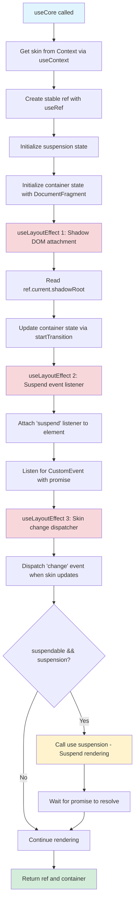
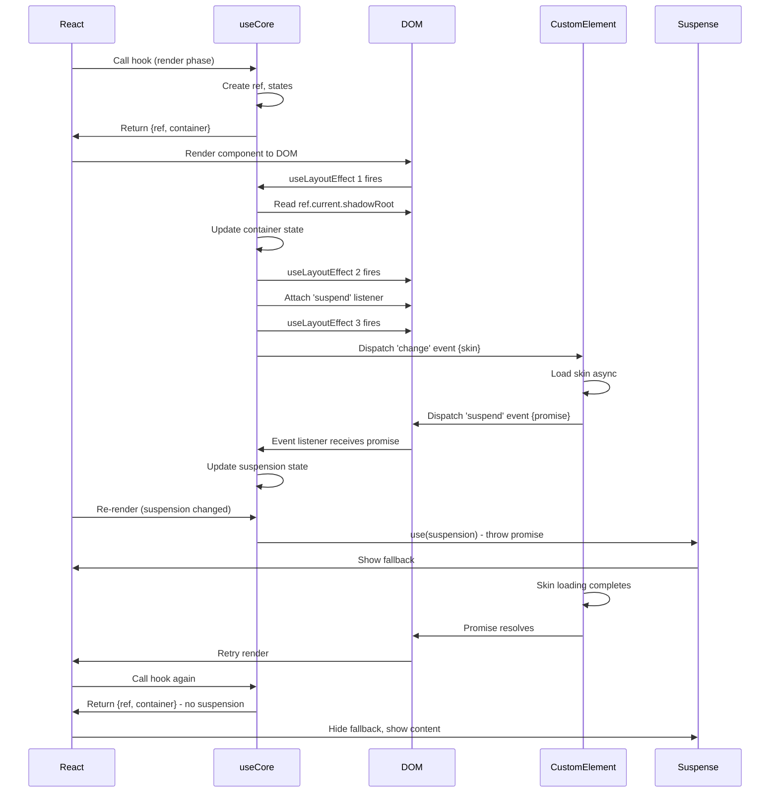
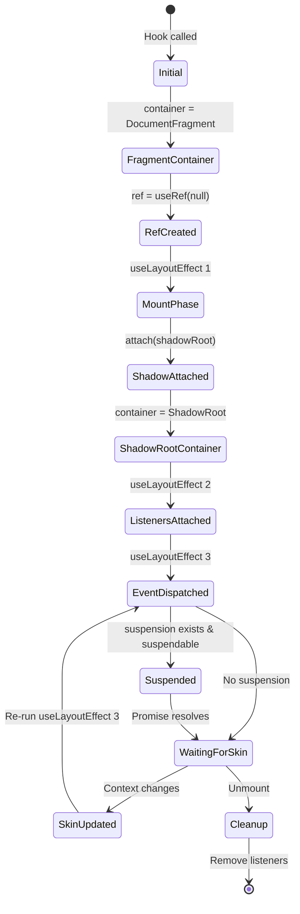
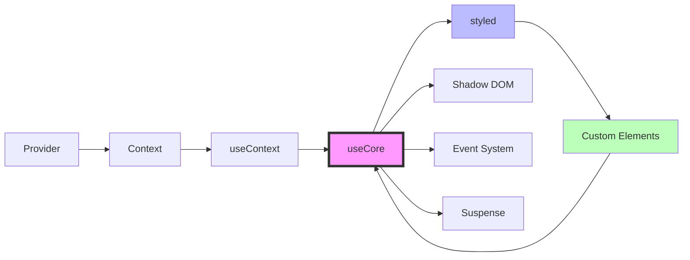

# useCore - Shadow DOM & Lifecycle Management Hook

## Overview

The `use-core/` module exports the most complex and critical hook in the flesh-cage architecture: `useCore`. This hook orchestrates the intricate dance between React's component lifecycle, the browser's Shadow DOM API, custom element lifecycle, and asynchronous skin loading with React 18's Suspense mechanism.

**Purpose:** Manage Shadow DOM attachment, event-driven communication, suspension handling, and ref stability for styled components. This is the bridge between React's virtual DOM and the browser's Shadow DOM, enabling encapsulated styling while maintaining React's reactivity model.

**Lines of code:** 43 lines (3 imports, 1 hook with 40 lines of implementation including 3 `useLayoutEffect` hooks, 2 `useState` hooks, conditional suspension logic)

**Complexity level:** CRITICAL - This is the most complex hook in the system. Every line matters. Changes here can break the entire styling system.

**Dependencies:**

- `react` - For `startTransition`, `use`, `useLayoutEffect`, `useRef`, `useState`
- `../stylable/` - For the `Stylable` type interface (used to type the custom element ref)
- `../use-context/` - For accessing the current skin name from Context

**Dependents:**

- `../styled/` - Primary consumer, uses this hook in every styled component
- User applications - Indirectly via styled components
- Test suites - Tests verify hook behavior across lifecycle phases

## Philosophy & Design Decisions

### Why This Hook Exists

The `useCore` hook solves a fundamental problem: **How do you connect React's component model to Shadow DOM's encapsulation while supporting async skin loading and React 18 Suspense?**

Shadow DOM provides style encapsulation, but it's a browser API that exists outside React's paradigm. React components render to the virtual DOM, which reconciles with the real DOM. But Shadow DOM adds a third layer—an isolated styling boundary that React doesn't understand natively.

**The challenge:**

1. Shadow DOM can only be attached after an element exists in the real DOM
2. React components may render before the DOM is ready
3. Skin loading is asynchronous, but React needs synchronous access to refs
4. Custom elements need to know when skins change (for style updates)
5. Suspense requires throwing promises, but hooks can't throw in cleanup

**Our solution:** A hook that:

- Uses `useLayoutEffect` to synchronize with DOM mutations
- Provides stable refs that survive re-renders
- Creates a portal target (container) for rendering children
- Listens for suspension events from custom elements
- Dispatches change events when skin context updates
- Integrates with React 18's `use()` hook for Suspense support

### Why useLayoutEffect Instead of useEffect?

```typescript
useLayoutEffect(() => {
  const transition = () => attach(ref.current?.shadowRoot as ShadowRoot)
  return startTransition(transition)
}, [])
```

**Critical decision:** We use `useLayoutEffect` for all DOM interactions, not `useEffect`.

**Rationale:**

1. **Synchronous DOM access:** Shadow DOM attachment must happen before children render. `useLayoutEffect` runs synchronously after DOM mutations but before browser paint, guaranteeing the shadow root exists before React tries to render children into it.

2. **Ref stability:** If we used `useEffect`, there would be a frame where `ref.current` exists but `shadowRoot` is null, causing a race condition when the styled component tries to create a portal.

3. **Event listener timing:** Event listeners must be attached before the custom element dispatches events. `useLayoutEffect` ensures listeners are ready before the browser paints, preventing missed events.

4. **Visual consistency:** Using `useLayoutEffect` prevents a flash of unstyled content (FOUC) by ensuring styles are adopted before the component is visible.

**Tradeoff:** `useLayoutEffect` blocks browser painting, which can hurt performance if the callback is slow. However, our callbacks are fast (just attaching shadow roots and event listeners), so the tradeoff is acceptable.

### Why startTransition for Shadow DOM Attachment?

```typescript
const transition = () => attach(ref.current?.shadowRoot as ShadowRoot)
return startTransition(transition)
```

**Decision:** Wrap the shadow root attachment in `startTransition`.

**Rationale:**

1. **Non-blocking updates:** `startTransition` marks the state update (calling `attach`) as non-urgent, allowing React to prioritize more important updates (like user input) first.

2. **Concurrent rendering compatibility:** In React 18's concurrent mode, transitions can be interrupted. This prevents shadow DOM attachment from blocking high-priority updates.

3. **Smoother UX:** If the application is under heavy load, `startTransition` ensures the UI stays responsive by deferring the shadow root state update.

**Important note:** We return `startTransition(transition)`, which seems unusual. `startTransition` doesn't return a cleanup function, but returning it from `useLayoutEffect` is safe—React will ignore the return value if it's not a function.

**Rejected alternative:**

```typescript
// ❌ Rejected: Immediate state update blocks rendering
useLayoutEffect(() => {
  attach(ref.current?.shadowRoot as ShadowRoot)
}, [])
// Reason: Could block high-priority updates in concurrent mode
```

### Why Two State Hooks (suspension and container)?

```typescript
const [suspension, persist] = useState<Promise<unknown> | undefined>()
const [container, attach] = useState<DocumentFragment | ShadowRoot>(
  document.createDocumentFragment()
)
```

**Decision:** Use two separate state hooks instead of a single object.

**Rationale:**

1. **Independent updates:** `suspension` and `container` update at different times. Separate state hooks prevent unnecessary re-renders when only one value changes.

2. **Semantic clarity:** Each state has a distinct purpose:
   - `suspension`: Tracks the active promise for Suspense integration
   - `container`: Tracks the portal target (fragment → shadow root)

3. **Naming expressiveness:** `persist` and `attach` are more descriptive than generic setters like `setState1` and `setState2`.

**Initial container value:**

```typescript
document.createDocumentFragment()
```

We initialize `container` to a `DocumentFragment` (not `null`) because:

- Children can safely render into a fragment before the shadow root is ready
- Avoids null checks in the styled component
- Provides a "staging area" for initial render

Once the shadow root is attached (in the first `useLayoutEffect`), we update `container` to point to the `ShadowRoot`, and React will move the children from the fragment to the shadow root via portal reconciliation.

### Why Hybrid Communication Pattern?

```typescript
// Listening for suspend events (custom element → React)
element.addEventListener('suspend', suspend)

// Calling change method (React → custom element)
element.change({ skin })
```

**Decision:** Use a hybrid approach: custom DOM events for custom element → React communication, and direct method calls for React → custom element communication.

**Rationale:**

1. **Type safety:** The `Stylable` abstract class provides a typed interface. Calling `element.change({ skin })` is type-checked, catching errors at compile time.

2. **Explicit contract:** Custom elements extending `Stylable` must implement the `change()` method, making the API explicit.

3. **Standard events for async:** Custom elements dispatch 'suspend' events because suspension happens asynchronously after skin loading starts. Events are ideal for this "fire and notify later" pattern.

4. **Direct calls for sync:** When React needs to tell the element to change skins, a direct method call is simpler and more efficient than creating/dispatching events.

**Communication patterns:**

- `suspend` event: Dispatched by custom elements when skin loading starts (carries a promise). React listens for this to integrate with Suspense.
- `change()` method: Called by React when skin context changes. The custom element implements this method (via `Stylable` abstract class).

**Rejected alternatives:**

- **Events only:** Would lose TypeScript type safety for skin changes
- **Methods only:** Custom elements can't call React methods (need events for async notifications)
- **Callbacks:** Would require custom elements to hold references to React functions (memory leaks)

### Why use() Hook for Suspense?

```typescript
if (suspendable && suspension) {
  use(suspension)
}
```

**Decision:** Conditionally call React 18's `use()` hook based on `suspendable` prop and `suspension` state.

**Rationale:**

1. **Suspense integration:** The `use()` hook is React's mechanism for "throwing" promises to trigger Suspense boundaries. When we call `use(suspension)`, React will suspend rendering and show the nearest `<Suspense>` fallback until the promise resolves.

2. **Opt-in behavior:** The `suspendable` prop allows components to choose whether they want Suspense behavior. If `suspendable` is `false`, the component renders immediately (even if skin loading is slow).

3. **Progressive enhancement:** Components work fine without Suspense boundaries—they just render with unstyled content until skins load. Adding a Suspense boundary improves UX but isn't required.

**Conditional logic breakdown:**

```typescript
if (suspendable && suspension) {
  // suspendable: User opted into Suspense behavior
  // suspension: A promise exists (custom element dispatched 'suspend' event)
  use(suspension) // Suspend rendering until promise resolves
}
// If either condition is false, render immediately (don't suspend)
```

**Important:** The `use()` hook is called conditionally, which normally violates the Rules of Hooks. However, `use()` is explicitly designed to be called conditionally—it's an exception to the rule.

**Rejected alternative:**

```typescript
// ❌ Rejected: Always suspend
if (suspension) {
  use(suspension)
}
// Reason: Forces all components to use Suspense, removes flexibility
```

## Architecture

### Hook Execution Flow



### Component Lifecycle Interaction



### State Synchronization Diagram



## Code Walkthrough

Let's analyze every line of the `useCore` hook implementation:

### Imports and Hook Signature

```typescript
import { startTransition, use, useLayoutEffect, useRef, useState } from 'react'
```

**Imports:**

- `startTransition`: Concurrent mode API for non-blocking state updates
- `use`: React 18 hook for Suspense integration (throwing promises)
- `useLayoutEffect`: Synchronous effect for DOM mutations
- `useRef`: Stable reference to DOM element (survives re-renders)
- `useState`: Reactive state for suspension tracking and container updates

```typescript
import { type Stylable } from '../stylable'
import { useContext } from '../use-context'
```

**Relative imports:**

- `Stylable` type: Imported from `../stylable/` for typing the custom element ref. This abstract class defines the `change()` method interface that custom elements must implement.
- `useContext`: Imports our context hook (not React's `useContext`) to get the current skin name.

```typescript
export const useCore = ({ suspendable }: { suspendable: boolean }) => {
```

**Function signature:**

- Exported as a named export (not default) for consistent API
- Takes a single object parameter with `suspendable` flag
- Returns an object with `ref` and `container` (inferred return type)

**Why object parameter?** Future-proofing—makes it easy to add more options without breaking existing calls.

### Context and Ref Setup (Lines 6-7)

```typescript
const skin = useContext()
```

**Purpose:** Get the current skin name from React Context (provided by `<Provider>`).

**Important:** This is our `useContext` wrapper (from `../use-context/`), not React's `useContext`.

**Value:** `string | undefined`

- `string` when inside a `<Provider skin="name">`
- `undefined` when no Provider exists

**Reactivity:** When the Provider's `skin` prop changes, this value updates, triggering a re-render.

```typescript
const ref = useRef<HTMLElement>(null)
```

**Purpose:** Create a stable reference to the custom element that will be rendered.

**Type:** `MutableRefObject<HTMLElement | null>`

- Generic type `<HTMLElement>` ensures TypeScript knows this refs a DOM element
- Initial value is `null` (element doesn't exist yet)

**Stability:** The ref object itself never changes—only `ref.current` changes when React attaches it to an element. This stability is critical for:

1. Event listeners (they reference `ref.current`, which persists across re-renders)
2. Shadow DOM attachment (we read `ref.current.shadowRoot` safely)

**Important:** This ref will be passed to the custom element in the styled component via JSX's `ref` prop.

### State Initialization (Lines 8-11)

```typescript
const [suspension, persist] = useState<Promise<unknown> | undefined>()
```

**Purpose:** Track the active skin loading promise for Suspense integration.

**Type:** `Promise<unknown> | undefined`

- `undefined`: No skin loading in progress (initial state)
- `Promise<unknown>`: Custom element dispatched a 'suspend' event with a promise

**Setter naming:** `persist` (not `setSuspension`) semantically indicates we're "persisting" a promise for future use.

**Lifecycle:**

1. Initial: `undefined`
2. Custom element dispatches 'suspend' event: `persist(promise)` → `suspension = promise`
3. Hook re-renders, calls `use(suspension)` → React suspends
4. Promise resolves → Custom element doesn't dispatch new event → `suspension` stays as resolved promise
5. Next 'suspend' event → `persist(newPromise)` → `suspension = newPromise`

```typescript
const [container, attach] = useState<DocumentFragment | ShadowRoot>(
  document.createDocumentFragment()
)
```

**Purpose:** Track the portal target where children will render.

**Type:** `DocumentFragment | ShadowRoot`

- Initial: `DocumentFragment` (temporary staging area)
- After shadow root attached: `ShadowRoot` (actual encapsulated rendering target)

**Setter naming:** `attach` (not `setContainer`) semantically indicates we're "attaching" the shadow root.

**Why DocumentFragment initially?**

1. **Safe fallback:** Children can render into a fragment without errors
2. **Portal compatibility:** React portals work with fragments
3. **Zero-cost abstraction:** Fragments are lightweight, no DOM overhead

**Why not null?**

```typescript
// ❌ Rejected: Requires null checks everywhere
const [container, attach] = useState<ShadowRoot | null>(null)

// In styled component:
if (!container) return null // Children don't render until shadow root ready
```

With `DocumentFragment`, children render immediately (into the fragment), then React automatically moves them to the shadow root when `container` updates. No null checks needed.

### useLayoutEffect 1: Shadow DOM Attachment (Lines 13-17)

```typescript
useLayoutEffect(() => {
  const transition = () => attach(ref.current?.shadowRoot as ShadowRoot)

  return startTransition(transition)
}, [])
```

**Purpose:** Attach the shadow root to the `container` state after the custom element is mounted.

**Timing:** Runs synchronously after DOM mutations (element exists) but before browser paint.

**Empty dependency array:** `[]` means this effect runs once on mount, never again.

**Line-by-line breakdown:**

```typescript
const transition = () => attach(ref.current?.shadowRoot as ShadowRoot)
```

**What this does:**

1. `ref.current`: Get the custom element (could be `null` if not yet attached)
2. `?.shadowRoot`: Optional chaining—safely access `shadowRoot` property (returns `undefined` if `ref.current` is `null`)
3. `as ShadowRoot`: Type assertion—tells TypeScript this is definitely a `ShadowRoot` (not `null` or `undefined`)
4. `attach(...)`: Update the `container` state with the shadow root

**Why type assertion?** At this point, we know the custom element exists (React has attached the ref) and has a shadow root (custom elements are defined with `attachShadow`). The `?.` is defensive programming, but we assert the type because we're confident it's not null.

**Why wrap in a function?** `startTransition` expects a callback, not a direct state update.

```typescript
return startTransition(transition)
```

**What this does:**

1. Call `startTransition(transition)` → React marks the `attach()` call as a non-urgent update
2. Return the result (which is `undefined`, but returning it is harmless)

**Why return?** Convention—some effects return cleanup functions. Here, we're not returning a cleanup function (shadow DOM attachment doesn't need cleanup), but returning the `startTransition` call is safe.

**Subtle bug:** `startTransition` doesn't return a cleanup function—it returns `undefined`. Returning it from `useLayoutEffect` is harmless but unconventional. A clearer implementation:

```typescript
useLayoutEffect(() => {
  startTransition(() => {
    attach(ref.current?.shadowRoot as ShadowRoot)
  })
}, [])
```

### useLayoutEffect 2: Suspend Event Listener (Lines 19-30)

```typescript
useLayoutEffect(() => {
  const element = ref.current as HTMLElement
  const suspend = (event: Event) => {
    const { detail } = event as CustomEvent<Promise<unknown>>

    return persist(detail)
  }

  element.addEventListener('suspend', suspend)

  return element.removeEventListener.bind(element, 'suspend', suspend)
}, [])
```

**Purpose:** Listen for 'suspend' events from the custom element and update the `suspension` state with the promise.

**Timing:** Runs synchronously after DOM mutations, before browser paint.

**Empty dependency array:** `[]` means this effect runs once on mount, never again. The listener persists for the component's lifetime.

**Line-by-line breakdown:**

```typescript
const element = ref.current as HTMLElement
```

**What this does:** Get the custom element and assert it's an `HTMLElement` (not `null`).

**Why type assertion?** At this point, React has attached the ref (we're in a layout effect after render), so `ref.current` is guaranteed to be the element.

```typescript
const suspend = (event: Event) => {
  const { detail } = event as CustomEvent<Promise<unknown>>

  return persist(detail)
}
```

**Event handler:**

1. Receives a generic `Event` object (typed as `Event` for compatibility)
2. Casts to `CustomEvent<Promise<unknown>>` to access the `detail` property
3. Extracts `detail` (which is the promise from the custom element)
4. Calls `persist(detail)` to update the `suspension` state

**Why return `persist(detail)`?** Convention—returning the result of the state setter. The return value is unused (event handlers don't need return values), but it's harmless.

**Type safety:** `CustomEvent<Promise<unknown>>` tells TypeScript:

- This is a `CustomEvent` (has `detail` property)
- The `detail` is a `Promise<unknown>` (skin loading promise)

```typescript
element.addEventListener('suspend', suspend)
```

**What this does:** Register the `suspend` handler for 'suspend' events on the custom element.

**Event name:** 'suspend' is a custom event name (not a standard DOM event). Custom elements dispatch this event when skin loading starts.

```typescript
return element.removeEventListener.bind(element, 'suspend', suspend)
```

**Cleanup function:** Removes the event listener when the component unmounts.

**Why `.bind()`?** This is a clever trick:

- `element.removeEventListener.bind(element, 'suspend', suspend)` creates a bound function
- When called (by React during cleanup), it's equivalent to `element.removeEventListener('suspend', suspend)`
- This avoids creating a separate cleanup function

**Equivalent conventional cleanup:**

```typescript
return () => {
  element.removeEventListener('suspend', suspend)
}
```

Both work, but the `.bind()` approach is more concise.

### useLayoutEffect 3: Skin Change Caller (Lines 33-37)

```typescript
useLayoutEffect(() => {
  const element = ref.current as Stylable

  element.change({ skin })
}, [skin])
```

**Purpose:** Notify the custom element when the skin changes (via Context Provider update).

**Timing:** Runs synchronously after DOM mutations, before browser paint.

**Dependency array:** `[skin]` means this effect runs on mount AND whenever `skin` changes.

**Line-by-line breakdown:**

```typescript
const element = ref.current as Stylable
```

**What this does:** Get the custom element and assert it's a `Stylable` instance. The `Stylable` type (from `../stylable/`) is an abstract class that defines the interface for skin-switching custom elements.

```typescript
element.change({ skin })
```

**What this does:**

1. Call the `change()` method directly on the custom element
2. Pass the current skin name in a context object `{ skin }`
3. The custom element's `change()` method handles skin validation and style adoption

**Method call flow:**

1. User changes Provider's `skin` prop: `<Provider skin="dark">` → `<Provider skin="light">`
2. Context value updates, triggering re-render
3. `useCore` hook re-runs, `skin` variable changes from "dark" to "light"
4. `useLayoutEffect` detects `skin` changed (dependency array `[skin]`)
5. Effect re-runs, calls `element.change({ skin: 'light' })`
6. Custom element's `change()` method loads and applies the new skin styles

**Why direct method call instead of events?** The `Stylable` abstract class provides a typed interface for skin changes. Using a direct method call:

- Provides TypeScript type safety
- Avoids the overhead of event creation and dispatch
- Makes the API contract explicit (elements must implement `change()`)

**Why no cleanup?** Calling a method is instantaneous—no resources to clean up.

**Important:** This effect runs on mount too (when `skin` is first set). This ensures the custom element receives the initial skin name, even if the Provider doesn't change.

### Suspense Integration (Lines 38-40)

```typescript
if (suspendable && suspension) {
  use(suspension)
}
```

**Purpose:** Suspend rendering if the component is suspendable and a skin loading promise exists.

**Conditional logic:**

- `suspendable`: The styled component opted into Suspense behavior (via `suspendable: true` config)
- `suspension`: A promise exists (custom element dispatched a 'suspend' event)
- Both must be true to suspend

**What `use()` does:**

1. Checks if the promise is resolved or pending
2. If pending: Throws the promise (React catches it, shows Suspense fallback)
3. If resolved: Returns the resolved value (rendering continues)

**Important:** The `use()` hook is called conditionally, which normally violates the Rules of Hooks. However, `use()` is explicitly designed to be called conditionally—it's an exception.

**Behavior by state:**

| `suspendable` | `suspension` | Behavior                                        |
| ------------- | ------------ | ----------------------------------------------- |
| `false`       | `undefined`  | Render immediately (no suspension)              |
| `false`       | `Promise`    | Render immediately (ignore promise)             |
| `true`        | `undefined`  | Render immediately (no promise to wait for)     |
| `true`        | `Promise`    | Suspend (throw promise, show Suspense fallback) |

**Example flow:**

```typescript
// Initial render: suspendable=true, suspension=undefined
if (true && undefined) { // false
  use(undefined) // not called
}
// Renders immediately

// Custom element dispatches 'suspend' event with promise
// Re-render: suspendable=true, suspension=<pending promise>
if (true && <promise>) { // true
  use(<promise>) // suspends rendering
}
// React shows Suspense fallback

// Promise resolves
// Re-render: suspendable=true, suspension=<resolved promise>
if (true && <promise>) { // true
  use(<promise>) // returns resolved value (doesn't suspend)
}
// Rendering completes
```

### Return Statement (Line 42)

```typescript
return { container, ref } as const
```

**Purpose:** Return the portal target and element ref to the styled component.

**Return type:** `{ container: DocumentFragment | ShadowRoot, ref: RefObject<HTMLElement> }` (inferred)

**`as const` assertion:** Makes the return type readonly and literal:

- Without: `{ container: DocumentFragment | ShadowRoot, ref: RefObject<HTMLElement> }`
- With: `readonly { container: DocumentFragment | ShadowRoot, ref: RefObject<HTMLElement> }`

**Why `as const`?** Signals to TypeScript that the returned object is immutable—callers shouldn't modify `container` or `ref`. This catches bugs like:

```typescript
const result = useCore({ suspendable: true })
result.ref = null // ❌ TypeScript error (readonly)
```

**Usage in styled component:**

```typescript
const { container, ref } = useCore({ suspendable: config.suspendable ?? false })

// ref: Passed to custom element for Shadow DOM access
<custom-element ref={ref} />

// container: Used as portal target for children
createPortal(children, container)
```

## Usage Examples

### Basic Usage with Styled Components

```typescript
import { styled } from '@everything-dies/flesh-cage/core'

// Define a simple button with two skins
const Button = styled({
  name: 'my-button',
  skins: {
    light: () => import('./skins/button-light.css'),
    dark: () => import('./skins/button-dark.css'),
  },
})

// Use in application
function App() {
  return (
    <Provider skin="dark">
      <Button>Click me</Button>
    </Provider>
  )
}

// Behind the scenes, useCore manages:
// 1. Shadow DOM attachment for <my-button> custom element
// 2. Portal creation for "Click me" children
// 3. Event communication for skin changes
// 4. No suspension (suspendable defaults to false)
```

### Suspension Handling with Suspense Boundary

```typescript
import { Suspense } from 'react'
import { styled, Provider } from '@everything-dies/flesh-cage/core'

// Define a suspendable component (waits for skin to load before rendering)
const Card = styled({
  name: 'my-card',
  skins: {
    default: () => import('./skins/card.css'), // Async import
  },
  suspendable: true, // Enable Suspense integration
})

function App() {
  return (
    <Provider skin="default">
      <Suspense fallback={<div>Loading theme...</div>}>
        <Card>
          <h2>Welcome</h2>
          <p>This card waits for styles to load before rendering.</p>
        </Card>
      </Suspense>
    </Provider>
  )
}

// Behind the scenes, useCore:
// 1. Custom element dispatches 'suspend' event with skin loading promise
// 2. useCore receives event, updates suspension state
// 3. Re-render triggers, useCore calls use(suspension)
// 4. React suspends, shows "Loading theme..." fallback
// 5. Skin loads, promise resolves, useCore no longer suspends
// 6. React hides fallback, renders card with styles
```

### Event Dispatching for Dynamic Skins

```typescript
import { styled, Provider } from '@everything-dies/flesh-cage/core'
import { useState } from 'react'

const ThemeablePanel = styled({
  name: 'themeable-panel',
  skins: {
    light: () => import('./skins/panel-light.css'),
    dark: () => import('./skins/panel-dark.css'),
    'high-contrast': () => import('./skins/panel-high-contrast.css'),
  },
})

function App() {
  const [theme, setTheme] = useState('light')

  return (
    <Provider skin={theme}>
      <button onClick={() => setTheme('dark')}>Dark Mode</button>
      <button onClick={() => setTheme('light')}>Light Mode</button>
      <button onClick={() => setTheme('high-contrast')}>High Contrast</button>

      <ThemeablePanel>
        <h1>Dynamic Theming</h1>
        <p>Current theme: {theme}</p>
      </ThemeablePanel>
    </Provider>
  )
}

// Behind the scenes, when user clicks "Dark Mode":
// 1. setTheme('dark') updates state
// 2. Provider re-renders with new skin="dark"
// 3. useCore's useLayoutEffect 3 fires (skin changed)
// 4. Dispatches 'change' event with {skin: 'dark'}
// 5. Custom element receives event, loads dark skin
// 6. Custom element updates adoptedStyleSheets
// 7. Panel re-styles instantly (Shadow DOM encapsulation)
```

### Shadow DOM Access for Advanced Use Cases

```typescript
import { styled } from '@everything-dies/flesh-cage/core'
import { useEffect, useRef } from 'react'

const InteractiveWidget = styled({
  name: 'interactive-widget',
  skins: {
    default: () => import('./skins/widget.css'),
  },
})

function AdvancedWidget() {
  const widgetRef = useRef<HTMLElement>(null)

  useEffect(() => {
    // Access shadow root directly for imperative DOM manipulation
    const shadowRoot = widgetRef.current?.shadowRoot

    if (shadowRoot) {
      // Query elements inside shadow DOM
      const internalButton = shadowRoot.querySelector('button')

      if (internalButton) {
        internalButton.addEventListener('click', () => {
          console.log('Internal button clicked')
        })
      }
    }
  }, [])

  return (
    <InteractiveWidget ref={widgetRef}>
      <button>Click me</button>
    </InteractiveWidget>
  )
}

// Behind the scenes, useCore:
// 1. Creates stable ref with useRef (returned as {ref})
// 2. Styled component passes ref to custom element
// 3. React attaches ref.current to custom element
// 4. useCore attaches shadow root via useLayoutEffect
// 5. User code can access shadowRoot via ref.current.shadowRoot
```

### Multiple Suspension/Resume Cycles

```typescript
import { Suspense, useState } from 'react'
import { styled, Provider } from '@everything-dies/flesh-cage/core'

const DynamicCard = styled({
  name: 'dynamic-card',
  skins: {
    red: () => import('./skins/card-red.css'),
    blue: () => import('./skins/card-blue.css'),
    green: () => import('./skins/card-green.css'),
  },
  suspendable: true,
})

function App() {
  const [skin, setSkin] = useState('red')

  return (
    <Provider skin={skin}>
      <button onClick={() => setSkin('red')}>Red</button>
      <button onClick={() => setSkin('blue')}>Blue</button>
      <button onClick={() => setSkin('green')}>Green</button>

      <Suspense fallback={<div>Loading skin...</div>}>
        <DynamicCard>
          <p>Current skin: {skin}</p>
        </DynamicCard>
      </Suspense>
    </Provider>
  )
}

// Behind the scenes, when user clicks "Blue" then "Green":
// 1. setSkin('blue') updates state
// 2. Provider re-renders with skin="blue"
// 3. useCore's useLayoutEffect 3 dispatches 'change' event
// 4. Custom element starts loading blue skin, dispatches 'suspend' event
// 5. useCore receives event, updates suspension state
// 6. Re-render calls use(suspension), React suspends, shows fallback
// 7. Blue skin loads, promise resolves, React resumes, hides fallback
// 8. User immediately clicks "Green" before blue skin finishes rendering
// 9. setSkin('green') updates state
// 10. useCore dispatches 'change' event with skin="green"
// 11. Custom element cancels blue skin load, starts loading green skin
// 12. Custom element dispatches new 'suspend' event with green promise
// 13. useCore updates suspension state with new promise
// 14. React suspends again, shows fallback
// 15. Green skin loads, promise resolves, React resumes
// 16. Card renders with green skin
```

## Related Modules

### Dependencies

- **[../stylable/](../stylable/README.md)** - Provides the `Stylable` abstract class type. Custom elements must extend this class to work with `useCore`. The `change()` method on `Stylable` is called when skin context changes.

- **[../use-context/](../use-context/README.md)** - Provides access to the current skin name from React Context. The `useCore` hook calls `useContext()` to get the skin value, which triggers re-renders when the Provider's skin prop changes.

- **[../context/](../context/README.md)** - Indirectly used via `useContext`. The Context instance holds the current skin name.

- **[../types/](../types/README.md)** - Defines `StyledConfig` interface, which includes the `suspendable` boolean that controls Suspense behavior.

### Dependents

- **[../styled/](../styled/README.md)** - Primary consumer of `useCore`. Every styled component calls this hook to manage Shadow DOM and lifecycle. The styled factory creates components that:
  1. Call `useCore({ suspendable: config.suspendable ?? false })`
  2. Pass the returned `ref` to the custom element
  3. Use the returned `container` as a portal target for children

### Conceptual Relationships



**Flow:**

1. `Provider` sets skin value in `Context`
2. `useContext` reads skin from `Context`
3. `useCore` consumes skin, manages Shadow DOM and events
4. `styled` factory calls `useCore` in generated components
5. Custom elements dispatch events back to `useCore`

## Testing Strategy

The `useCore` hook is tested across three specialized test files, each focusing on a different aspect of the hook's behavior:

### 1. use-core.test.tsx - Core Hook Behavior

**Focus:** Verify the hook's return values, ref stability, and basic integration.

**Key tests:**

- Hook returns correct `ref` and `container` objects
- `ref` object is stable across re-renders (same object reference)
- `container` starts as `DocumentFragment`, updates to `ShadowRoot`
- Basic integration with mock custom elements

**Why separate from other tests?** Core behavior tests focus on the hook's contract (what it returns, ref stability) without complex lifecycle interactions. This makes tests simple and fast.

### 2. suspension.test.tsx - Suspense Integration

**Focus:** Verify suspension state management and Suspense integration.

**Key tests:**

- Hook responds to 'suspend' events from custom elements
- `suspension` state updates with promise from event
- Suspense boundary shows fallback when `suspendable=true` and promise is pending
- Suspense boundary hides fallback when promise resolves
- Multiple suspension/resume cycles work correctly
- Hook ignores suspension when `suspendable=false`

**Why separate from other tests?** Suspension logic is complex and involves async behavior, event handling, and React Suspense boundaries. Isolating these tests makes failures easier to debug and prevents test interdependencies.

### 3. shadow-dom.test.tsx - Shadow DOM Lifecycle

**Focus:** Verify Shadow DOM attachment, cleanup, and event listener lifecycle.

**Key tests:**

- Shadow DOM attached on mount (via `useLayoutEffect`)
- `container` updates from `DocumentFragment` to `ShadowRoot`
- Event listeners attached correctly (no errors when custom element dispatches events)
- Event listeners cleaned up on unmount (no memory leaks)
- 'change' events dispatched when skin updates

**Why separate from other tests?** Shadow DOM lifecycle tests involve DOM mutations, custom elements, and cleanup logic. Separating these tests prevents DOM state pollution across tests and makes it easier to verify memory leak prevention.

### Testing Utilities Used

All tests leverage shared utilities from `core/__tests__/`:

- `setup.ts` - Polyfills for Shadow DOM and adoptedStyleSheets (jsdom compatibility)
- `utils.ts` - Helpers like `getShadowCSS`, `waitForStyles`, `waitForCustomElement`

Tests also use:

- `@testing-library/react` - For `renderHook`, `render`, `waitFor`
- `vitest` - For `describe`, `it`, `expect`, `vi` (mocking)

### Coverage Goals

Target coverage for `use-core/index.ts`:

- **Line coverage:** 100% (every line executed)
- **Branch coverage:** 100% (all conditionals tested)
- **Function coverage:** 100% (hook and all callbacks tested)

**Critical paths to cover:**

1. Hook with `suspendable=false` (no suspension)
2. Hook with `suspendable=true` and pending promise (suspends)
3. Hook with `suspendable=true` and resolved promise (doesn't suspend)
4. Skin changes (re-runs useLayoutEffect 3)
5. Component unmount (cleanup functions)

## Common Pitfalls

### 1. useLayoutEffect Timing Issues

**Problem:** Calling code that depends on Shadow DOM before `useLayoutEffect` runs.

```typescript
// ❌ BAD: Accessing shadowRoot in render phase
const { ref } = useCore({ suspendable: false })
console.log(ref.current?.shadowRoot) // null! (not attached yet)

return <custom-element ref={ref}>...</custom-element>
```

**Why this fails:** Shadow DOM is attached in `useLayoutEffect`, which runs AFTER the render phase. During render, `ref.current.shadowRoot` is still `null`.

**Solution:** Access Shadow DOM in `useEffect` or `useLayoutEffect`, not during render.

```typescript
// ✅ GOOD: Access shadowRoot in effect
const { ref } = useCore({ suspendable: false })

useEffect(() => {
  console.log(ref.current?.shadowRoot) // ShadowRoot (attached now)
}, [])

return <custom-element ref={ref}>...</custom-element>
```

### 2. Ref Stability Assumptions

**Problem:** Assuming `ref.current` changes when `container` updates.

```typescript
const { ref, container } = useCore({ suspendable: false })

// ❌ BAD: Assuming ref.current changes when container updates
useEffect(() => {
  console.log('Container changed!')
}, [ref.current]) // React warns: ref.current is not a valid dependency
```

**Why this fails:** `ref.current` is a mutable property. React doesn't track changes to it. The `container` state updates (triggering re-renders), but `ref.current` stays the same object.

**Solution:** Depend on `container`, not `ref.current`.

```typescript
// ✅ GOOD: Depend on container state
useEffect(() => {
  console.log('Container changed!', container)
}, [container])
```

### 3. Suspension Edge Cases

**Problem:** Suspending without a Suspense boundary.

```typescript
const Card = styled({
  name: 'my-card',
  skins: { default: () => import('./card.css') },
  suspendable: true, // Enables suspension
})

function App() {
  return (
    <Provider skin="default">
      <Card>Content</Card>
    </Provider>
  )
}

// ❌ ERROR: No Suspense boundary!
// When Card suspends, React throws:
// "A component suspended while responding to synchronous input..."
```

**Why this fails:** When `use(suspension)` is called, React suspends rendering by "throwing" the promise. If there's no `<Suspense>` boundary to catch it, the error propagates to the root, crashing the app.

**Solution:** Always wrap suspendable components in `<Suspense>`.

```typescript
// ✅ GOOD: Suspense boundary catches suspension
function App() {
  return (
    <Provider skin="default">
      <Suspense fallback={<div>Loading...</div>}>
        <Card>Content</Card>
      </Suspense>
    </Provider>
  )
}
```

### 4. Event Listener Memory Leaks

**Problem:** Not cleaning up event listeners on unmount.

```typescript
// Hypothetical broken version of useCore
useLayoutEffect(() => {
  const element = ref.current as HTMLElement
  const suspend = (event: Event) => {
    const { detail } = event as CustomEvent<Promise<unknown>>
    persist(detail)
  }

  element.addEventListener('suspend', suspend)

  // ❌ BAD: No cleanup! Listener persists after unmount
}, [])
```

**Why this fails:** If the component unmounts, the event listener remains attached. When the custom element dispatches 'suspend' events, the listener runs, calling `persist()` on an unmounted component. This causes:

1. Memory leaks (listener holds references to unmounted component)
2. React warnings ("Can't perform state update on unmounted component")

**Solution:** Return a cleanup function from `useLayoutEffect`.

```typescript
// ✅ GOOD: Cleanup removes listener
useLayoutEffect(() => {
  const element = ref.current as HTMLElement
  const suspend = (event: Event) => {
    const { detail } = event as CustomEvent<Promise<unknown>>
    persist(detail)
  }

  element.addEventListener('suspend', suspend)

  return () => element.removeEventListener('suspend', suspend) // Cleanup
}, [])
```

### 5. Shadow Root Type Assertions

**Problem:** Type asserting `shadowRoot` without null checks.

```typescript
// Hypothetical fragile code
useLayoutEffect(() => {
  const shadowRoot = ref.current?.shadowRoot as ShadowRoot // Assertion
  attach(shadowRoot) // Might be null!
}, [])
```

**Why this is fragile:** If the custom element doesn't have a shadow root (e.g., defined with `{mode: 'open'}` but shadow root creation failed), the type assertion hides the null value, causing runtime errors.

**Mitigation:** Our current implementation uses optional chaining (`?.shadowRoot`), which safely handles null. The type assertion is safe because:

1. Custom elements are always defined with `attachShadow({ mode: 'open' })`
2. This happens synchronously before React attaches refs
3. The optional chaining is defensive (handles edge cases gracefully)

**Best practice:** Combine optional chaining with type assertions.

```typescript
// ✅ GOOD: Optional chaining + type assertion
const shadowRoot = ref.current?.shadowRoot as ShadowRoot | undefined
attach(shadowRoot ?? document.createDocumentFragment())
```

### 6. startTransition Misuse

**Problem:** Using `startTransition` for synchronous, urgent updates.

```typescript
// Hypothetical misuse
useLayoutEffect(() => {
  startTransition(() => {
    // ❌ BAD: Urgent DOM mutation in transition
    ref.current?.setAttribute('data-mounted', 'true')
  })
}, [])
```

**Why this is wrong:** `startTransition` marks updates as low-priority. If you need immediate DOM mutations (like setting attributes for accessibility), wrapping them in `startTransition` delays them, potentially causing bugs.

**When to use `startTransition`:**

- State updates that trigger re-renders (like `attach(shadowRoot)`)
- Non-urgent UI updates (like animations, transitions)

**When NOT to use `startTransition`:**

- Direct DOM mutations (use them directly)
- High-priority state updates (user input, accessibility)

In our implementation, `startTransition` is correct because:

1. Updating `container` state triggers a re-render (non-urgent)
2. Children can render into the `DocumentFragment` initially (no urgency)
3. Deferring the state update improves responsiveness under load

## Future Enhancements

### 1. Abort Controller Integration

**Goal:** Cancel in-flight skin loading when skin changes.

**Current behavior:** If the user changes skin from "light" to "dark" while "light" is still loading, both loads complete. The "light" load is wasted work.

**Proposed enhancement:**

```typescript
const [abortController, setAbortController] = useState<AbortController | null>(
  null
)

useLayoutEffect(() => {
  const element = ref.current as HTMLElement
  const suspend = (event: Event) => {
    const { detail } = event as CustomEvent<{
      promise: Promise<unknown>
      abort: AbortController
    }>

    // Cancel previous load
    if (abortController) {
      abortController.abort()
    }

    setAbortController(detail.abort)
    persist(detail.promise)
  }

  element.addEventListener('suspend', suspend)
  return () => element.removeEventListener('suspend', suspend)
}, [abortController])
```

**Benefits:**

- Reduces network usage (aborts unnecessary requests)
- Improves performance (no wasted work)
- Better UX (faster skin switching)

**Trade-offs:**

- More complex state management (track abort controllers)
- Requires custom elements to support abortion (breaking change)

### 2. Error Boundaries for Skin Loading Failures

**Goal:** Gracefully handle skin loading errors without crashing.

**Current behavior:** If a skin fails to load (network error, 404), the promise rejects, the component suspends indefinitely (Suspense boundary shows fallback forever), and no error is displayed.

**Proposed enhancement:**

```typescript
const [error, setError] = useState<Error | null>(null)

useLayoutEffect(() => {
  const element = ref.current as HTMLElement
  const suspend = (event: Event) => {
    const { detail } = event as CustomEvent<Promise<unknown>>

    // Catch errors in promise
    const wrappedPromise = detail.catch((err) => {
      setError(err)
      return null // Don't re-throw (prevents crash)
    })

    persist(wrappedPromise)
  }

  element.addEventListener('suspend', suspend)
  return () => element.removeEventListener('suspend', suspend)
}, [])

if (error) {
  throw error // Let Error Boundary catch it
}
```

**Benefits:**

- Better error handling (Error Boundaries can show fallback UI)
- Debugging info (error messages visible in dev tools)
- Production resilience (app doesn't crash on skin load failures)

**Trade-offs:**

- Requires Error Boundaries in user apps (more setup)
- Complicates hook logic (error state tracking)

### 3. Dev Mode Warnings

**Goal:** Warn developers about common mistakes in development.

**Examples:**

```typescript
if (process.env.NODE_ENV !== 'production') {
  // Warn if suspendable=true but no Suspense boundary detected
  if (suspendable && !isSuspenseBoundaryPresent()) {
    console.warn(
      '[useCore] Component is suspendable but no Suspense boundary found. ' +
        'Wrap in <Suspense> to prevent errors.'
    )
  }

  // Warn if shadow root is null (custom element not properly defined)
  useLayoutEffect(() => {
    if (!ref.current?.shadowRoot) {
      console.warn(
        '[useCore] Shadow root is null. Ensure custom element calls ' +
          'attachShadow({ mode: "open" }) in its constructor.'
      )
    }
  }, [])
}
```

**Benefits:**

- Helps developers catch mistakes early
- Provides actionable error messages
- No performance impact in production (warnings stripped by bundlers)

**Trade-offs:**

- More code (increases bundle size in dev mode)
- Requires detecting Suspense boundaries (complex)

### 4. Performance Metrics

**Goal:** Track skin loading performance for monitoring and optimization.

**Proposed enhancement:**

```typescript
useLayoutEffect(() => {
  const element = ref.current as HTMLElement
  const suspend = (event: Event) => {
    const { detail } = event as CustomEvent<Promise<unknown>>
    const startTime = performance.now()

    detail.then(() => {
      const endTime = performance.now()
      const duration = endTime - startTime

      // Report metric
      if (typeof window !== 'undefined' && window.reportPerformance) {
        window.reportPerformance('skin-load', { duration, skin })
      }
    })

    persist(detail)
  }

  element.addEventListener('suspend', suspend)
  return () => element.removeEventListener('suspend', suspend)
}, [skin])
```

**Benefits:**

- Visibility into skin loading performance
- Identifies slow skins for optimization
- Real user monitoring (RUM) integration

**Trade-offs:**

- More complex hook logic
- Requires performance monitoring setup

## Maintainer Notes: If I Die Tomorrow

### Critical Invariants

These invariants MUST hold for the system to work correctly. If you break any of these, the entire styling system will fail:

1. **Ref must be stable:** The `ref` object returned by `useRef` must never change across re-renders. If you replace it with a new ref, event listeners will break (they reference the old `ref.current`).

2. **Shadow root must be attached before children render:** The first `useLayoutEffect` (Shadow DOM attachment) must run before children render into the container. If you change it to `useEffect`, you'll introduce a race condition where children try to render into a null container.

3. **Event listeners must be cleaned up:** The second `useLayoutEffect` (suspend event listener) must return a cleanup function. If you remove the cleanup, event listeners will persist after unmount, causing memory leaks and "state update on unmounted component" warnings.

4. **Suspense integration is opt-in:** The `suspendable` prop must default to `false`. If you change it to `true` by default, every component will suspend, breaking apps without Suspense boundaries.

5. **Container must never be null:** The `container` state must always have a value (either `DocumentFragment` or `ShadowRoot`). If you change the initial value to `null`, React portals will crash when trying to render children.

### Fragile Areas

These areas are delicate and prone to bugs. Proceed with extreme caution:

1. **startTransition usage (Lines 13-17):** The `startTransition` wrapping is subtle. If you remove it, shadow root attachment becomes a high-priority update, potentially blocking user input under load. If you move it outside the `useLayoutEffect`, the timing changes (effect runs before transition starts), breaking the synchronization.

2. **Type assertions (Lines 14, 20):** The `as ShadowRoot` and `as HTMLElement` assertions are based on assumptions:
   - Custom elements always call `attachShadow({ mode: 'open' })`
   - React attaches refs before `useLayoutEffect` runs

   If these assumptions break (e.g., custom element defined without shadow root), the assertions hide null values, causing runtime errors.

3. **Conditional use() call (Lines 38-40):** The `use()` hook is called conditionally, which violates the Rules of Hooks. This works because `use()` is explicitly designed to be called conditionally. If React changes this behavior in future versions, this code will break.

4. **Event listener binding (Line 29):** The `.bind()` trick for cleanup is unconventional. If you refactor this to a traditional cleanup function, ensure you capture the correct `element` reference:

   ```typescript
   // ✅ GOOD: Capture element in closure
   return () => {
     element.removeEventListener('suspend', suspend)
   }

   // ❌ BAD: Re-read ref.current (might be null)
   return () => {
     ref.current?.removeEventListener('suspend', suspend)
   }
   ```

5. **Suspension state management (Line 8):** The `suspension` state holds a promise, which is unusual (React state usually holds primitive values or plain objects). If you add logic that depends on the promise identity (e.g., comparing promises), be aware that promises are compared by reference (not value).

### Debugging Guide

Common issues and how to diagnose them:

#### Issue: "Shadow root is null"

**Symptoms:** `container` stays as `DocumentFragment` forever, children don't render.

**Diagnosis:**

1. Check if custom element is defined: `console.log(customElements.get('element-name'))`
2. Check if shadow root was attached: `console.log(ref.current?.shadowRoot)`
3. Verify `attachShadow` is called in custom element constructor

**Fix:** Ensure custom element class calls `this.attachShadow({ mode: 'open' })` in constructor.

#### Issue: "A component suspended but no Suspense boundary was found"

**Symptoms:** App crashes with error when suspendable component renders.

**Diagnosis:**

1. Check if component has `suspendable: true` in config
2. Verify `<Suspense>` boundary exists in parent tree

**Fix:** Wrap component in `<Suspense fallback={<div>Loading...</div>}>`.

#### Issue: "Can't perform state update on unmounted component"

**Symptoms:** React warning in console after component unmounts.

**Diagnosis:**

1. Check if event listeners are cleaned up: add `console.log('cleanup')` in return statement
2. Verify cleanup runs on unmount: unmount component and check console

**Fix:** Ensure `useLayoutEffect` returns cleanup function that removes event listeners.

#### Issue: "Suspension never resolves"

**Symptoms:** Suspense fallback shows forever, component never renders.

**Diagnosis:**

1. Check if promise resolves: `suspension.then(() => console.log('resolved'))`
2. Verify custom element dispatches 'suspend' event with valid promise
3. Check for errors in promise: `suspension.catch(console.error)`

**Fix:** Ensure skin loading promise resolves (check network, import paths).

#### Issue: "Skin changes don't update styles"

**Symptoms:** Changing Provider's `skin` prop doesn't update component styles.

**Diagnosis:**

1. Check if 'change' event is dispatched: add listener to custom element
2. Verify `useLayoutEffect` runs when `skin` changes: add `console.log(skin)` in effect
3. Check if custom element updates styles on 'change' event

**Fix:** Ensure custom element listens for 'change' events and updates `adoptedStyleSheets`.

### Emergency Recovery

If you've broken the hook and need to recover quickly:

1. **Revert to previous commit:** The safest option. Run `git revert HEAD` to undo changes.

2. **Disable Suspense:** If suspension logic is broken, set `suspendable: false` in all styled configs to bypass `use()` hook.

3. **Remove startTransition:** If shadow root attachment is broken, remove `startTransition` wrapper:

   ```typescript
   useLayoutEffect(() => {
     attach(ref.current?.shadowRoot as ShadowRoot)
   }, [])
   ```

4. **Add defensive null checks:** If type assertions are causing crashes, replace them with null checks:

   ```typescript
   useLayoutEffect(() => {
     const shadowRoot = ref.current?.shadowRoot
     if (shadowRoot) {
       attach(shadowRoot)
     }
   }, [])
   ```

5. **Isolate the problem:** Comment out individual `useLayoutEffect` hooks to identify which one is causing issues, then fix that one specifically.

### Final Words

This hook is the heart of the flesh-cage system. It's complex because it bridges three different worlds (React, Shadow DOM, and custom elements), each with its own lifecycle and timing constraints. Every line of code exists for a reason—there are no "nice-to-haves" or "style choices" here. It's all critical path.

If you're making changes, test thoroughly:

- Test with `suspendable=false` and `suspendable=true`
- Test with and without Suspense boundaries
- Test skin changes (Provider updates)
- Test unmounting (check for memory leaks)
- Test rapid skin changes (stress test)

And remember: if you break this hook, every styled component in the system breaks. Proceed with caution, respect the complexity, and test exhaustively.

Good luck. You've got this.
